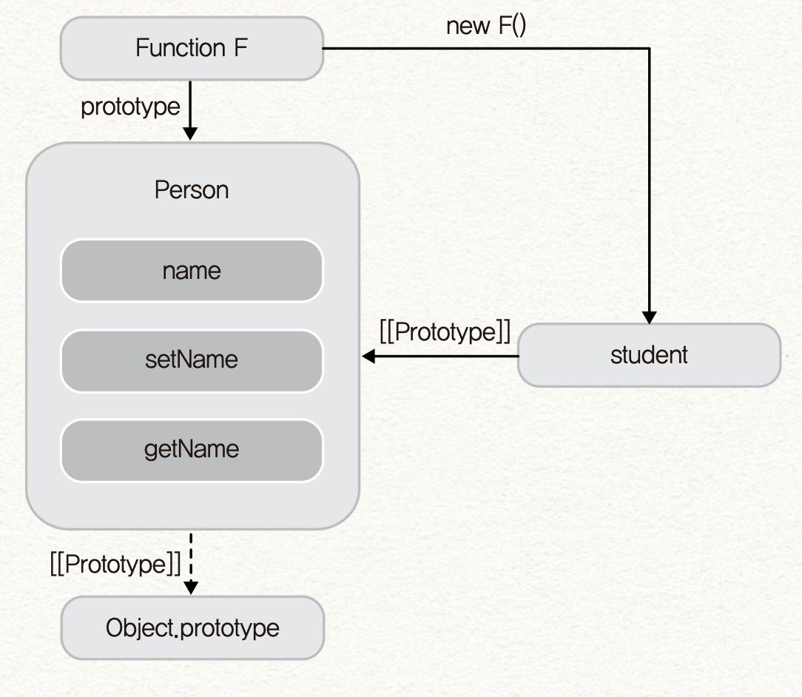
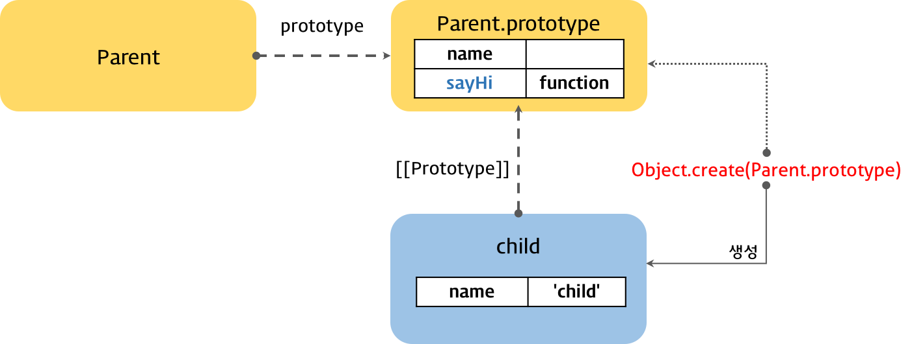

## 인사이드 자바스크립트

오늘은 인사이드 자바스크립트의 6장 객체지향 프로그래밍을 공부하였다.

6.1 클래스, 생성자, 메소드까지는 그럭저럭 이해가 되었으나, 6.2 상속 부분에서 정말 오후, 저녁 시간 내내 쩔쩔 매면서 읽었지만 도저히 이해가 되지 않았다.

내가 Java나 Python을 깊숙히 사용해본 것도 아닌데, 클래스 기반의 객체지향 프로그래밍에 자연스럽게 물들어 있었다. Java에서 사용하던 클래스 기반의 상속이 매끄럽고자연스럽고 직관적이라는 생각이 들었고, 반면에 자바스크립트의 프로토타입을 이용한상속 방식은 코드가 아니라 친절히 설명하는 그림을 봐도 너무 복잡하고 이해하기 어려웠다. 뭔가 커다란 장벽을 만난 기분이었다. (나는 자바스크립트를 하면 안되는 건가..) 자신감이 떨어지고 어딘가 물어보고 싶은 사람이 절실했다..

일단 이해되지 않는 점을 정리해본다.

- `Object.create()` 함수 - [🔗 MDN web docs](https://developer.mozilla.org/ko/docs/Web/JavaScript/Reference/Global_Objects/Object/create)

인사이드 자바스크립트 책에 따르면 ECMAScript 5에서 제공하는 `Object.create()` 함수의 내부 구현은 이러하다고 한다.

```javascript
function create_object(o) {
	function F() {}
	F.prototype = o;
	return new F();
}
```

이 함수를 이용해서 상속을 구현해보자.

```javascript
var Person = {
	name: 'zzoon',
	getName: function () {
		return this.name;
	},
	setName: function (arg) {
		this.name = arg;
	},
};

function create_object(o) {
	function F() {}
	F.prototype = o;
	return new F();
}

var student = create_object(person);

student.setName('me');
console.log(student.getName()); // me
```



이 그림까지는 이해가 되었다.

```javascript
var Parent = (function () {
	function Parent(name) {
		this.name = name;
	}

	Parent.prototype.sayHi = function () {
		console.log('Hi! ' + this.name);
	};

	return Parent;
})();

var child = Object.create(Parent.prototype);
child.name = 'child';

child.sayHi(); // Hi! child

console.log(child instanceof Parent); // true
```

> 예제 출처 : [🔗 자바스크립트 객체지향 프로그래밍 - Poiemaweb](https://poiemaweb.com/js-object-oriented-programming)

의문점 : 위 예제는 부모가 되는 `Person` 객체를 직접 넣은 반면, 이 예제에서는 `Parent.prototype` 을 `Object.create` 의 인수로 넣었는가?



앗.. 아래는 부모로 삼을 생성자 함수가 있는 경우에, 위는 부모로 삼을 객체가 있는경우에 사용할 수 있는 패턴인 것이었다..!

이해 안되는 점들

- `extend()` 함수

- `apply()` 함수 (대략은 이해됨 ..;;)

- 클래스 기반의 상속인 경우 왜 자식 클래스의 `prototype` 이 부모 클래스의 인스턴스를 참조하는데, 이 구조가 왜 자식 클래스의 `prototype` 에 메소드를 추가할 때문제가 되는가?


일단 객체지향 프로그래밍 부분을 내일 한번 더 공부해 봐야겠다. 그리고 패턴이 다양하다보니 어느 패턴이 좋다는 건지 이해가 안되겠는 상황이 종종 있다. 아직 1회독도안해봤기 때문에, 아직 다 이해하려는게 무리인거 같기도 하다.
