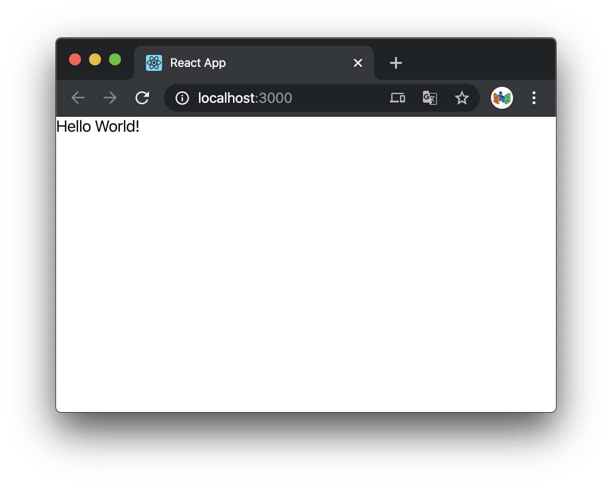

# {{ $frontmatter.title }}

## React

[벨로퍼트와 함께하는 모던 리액트](https://react.vlpt.us/)

### React Component 만들기

`Hello.js`

```javascript
import React from 'react';

function Hello() {
	return <div>Hello World!</div>;
}

export default Hello;
```

리액트 컴포넌트를 만들 땐

```javascript
import React from 'react';
```

를 넣어줘야한다.

리액트 컴포넌트는 XML 형식의 값을 반환할 수 있는데 이를 JSX 라고 부른다.

```javascript
export default Hello;
```

이 코드는 Hello 라는 컴포넌트를 내보내겠다는 의미.

`App.js`

```javascript
import React from 'react';
import Hello from './Hello';

function App() {
	return (
		<div>
			<Hello />
		</div>
	);
}

export default App;
```

실행시켜보면, ( `yarn start` or `npm start` )



`index.js`

```javascript
import React from 'react';
import ReactDOM from 'react-dom';
import './index.css';
import App from './App';
import * as serviceWorker from './serviceWorker';

ReactDOM.render(<App />, document.getElementById('root'));

// If you want your app to work offline and load faster, you can change
// unregister() to register() below. Note this comes with some pitfalls.
// Learn more about service workers: https://bit.ly/CRA-PWA
serviceWorker.unregister();
```

여기서 `ReactDOM.render` 를 보면, `id` 가 `root` 인 DOM 내부에 리액트 컴포넌트( `<App />` )를 렌더링하겠다는 의미이다.

이 DOM은 `public/index.html` 내부에 있다.

```javascript
<div id="root"></div>
```

### JSX

JavaScript + XML, 자바스크립트의 확장 문법. 자바스크립트 내부에 마크업 코드를 작성해 줄 수 있게 해줌. HTML 같이 생겼지만 실제론 JS 이다.

```javascript
return <div>안녕하세요</div>;
```

Babel 은 XML 형태의 코드를 JS로 변환해준다.

#### 규칙

- 태그를 열었으면 닫아야 함. ( `input` , `br` 포함 모든 태그. 태그 사이에 내용이없을 땐, `<input/>` 로 셀프클로징 가능)

- 두 개 이상의 태그는 하나의 태그로 감싸져 있어야 한다. `<> </>` Fragment로 사용한다면 불필요한 태그 없이 두 개 이상의 태그 가능.

- JSX 내부에 변수는 `{}` 로 감싸서 보여줄 수 있음.

#### `style` 과 `className`

`style` 과 CSS `class` 설정 방법이 HTML과 다르다.

- 인라인 스타일은 객체처럼 작성.

- `background-color` 같이 `-` 로 구분된 속성 이름을 가진 속성들은 camelCase 형태로 ( `backgroundColor` )

- CSS `class` 설정시엔 `class=""` 가 아닌 `className=""` 으로.

`App.js`

```javascript
import React from 'react';
import Hello from './Hello';
import './App.css';

function App() {
	const name = 'react';
	const style = {
		backgroundColor: 'black',
		color: 'aqua',
		fontSize: 24, // 기본 단위 px
		padding: '1rem', // 다른 단위 사용 시 문자열로 설정
	};

	return (
		<>
			<Hello />
			<div style={style}>{name}</div>
			<div className="gray-box"></div>
		</>
	);
}

export default App;
```

`App.css`

```css
.gray-box {
	background: gray;
	width: 64px;
	height: 64px;
}
```

#### 주석

`{/* JSX 내부 주석 작성법 */}`

열리는 태그 내부에서는 `// 이런 형태의 주석 작성도 가능`

### `props` 를 통해 컴포넌트에 값 전달

App 컴포넌트에서 Hello 컴포넌트를 사용할 때 값을 전달하고 싶을 때

`App.js`

```javascript
import React from 'react';
import Hello from './Hello';

function App() {
	return <Hello name="react" />;
}

export default App;
```

`Hello.js`

```javascript
import React from 'react';

function Hello(props) {
	return <div>안녕하세요 {props.name}</div>;
}

export default Hello;
```

`props` 라는 파라미터로 조회, 객체 형태로 전달되므로 `props.name` 으로 조회 가능

#### 비구조화 할당

`App.js`

```javascript
import React from 'react';
import Hello from './Hello';

function App() {
	return <Hello name="react" color="red" />;
}

export default App;
```

`name` , `color` 두 가지 값을 전달.

```javascript
import React from 'react';

function Hello(props) {
	return <div style={{color: props.color}}>안녕하세요 {props.name}</div>;
}

export default Hello;
```

> `color: props.color` 는 객체이므로 `{}` 로 한 번 감싸고, 이 객체가 JS 값이므로 `{}` 로 한번 더 감싼다.

두 가지 값을 전달할 때 비구조화 할당으로 간결하게 작성이 가능하다.

```javascript
import React from 'react';

function Hello({color, name}) {
	return <div style={{color}}>안녕하세요 {name}</div>;
	// color: color -> color 로 작성 가능
}

export default Hello;
```
