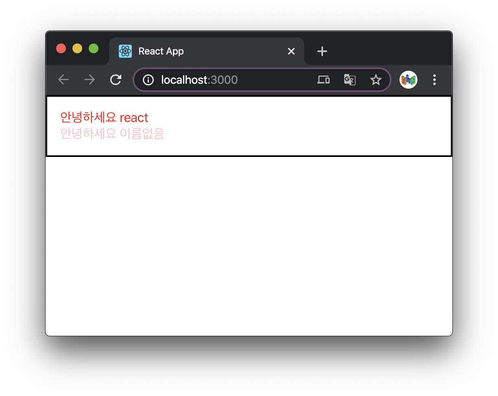
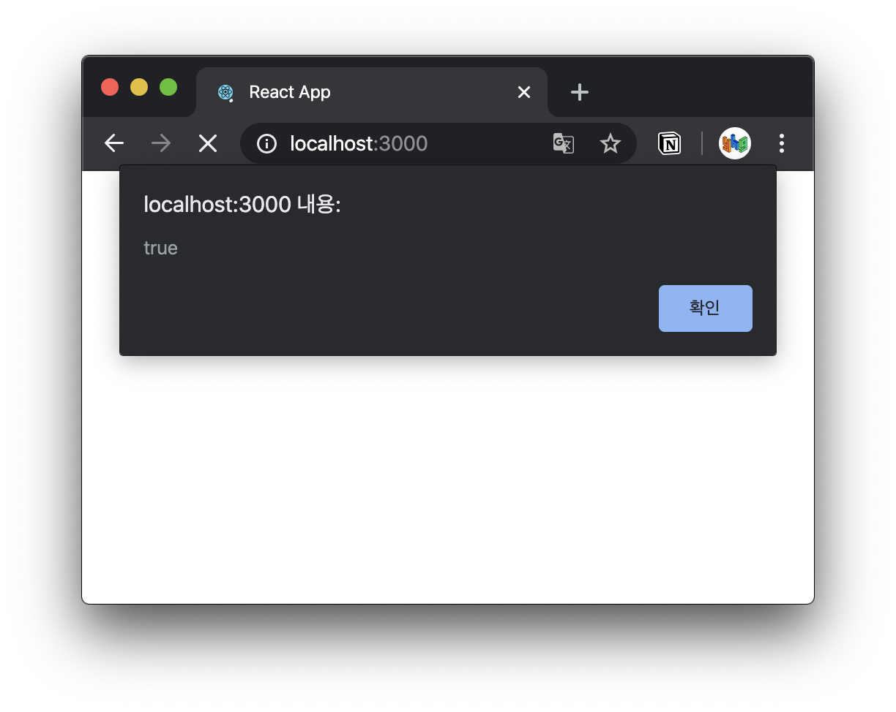

# {{ $frontmatter.title }}

## React

### `props` 를 통해 컴포넌트에게 값 전달하기 (계속)

#### `defaultProps` 로 기본값 설정

`Hello.js`

```javascript
import React from 'react';

function Hello({color, name}) {
	return <div style={{color}}>안녕하세요 {name}</div>;
}

Hello.defaultProps = {
	name: '이름없음',
};

export default Hello;
```

이렇게 컴포넌트에 `props` 를 지정하지 않았을 때 기본적으로 사용할 값을 설정할 수있다.

`App.js`

```javascript
import React from 'react';
import Hello from './Hello';

function App() {
	return (
		<>
			<Hello name="react" color="red" />
			<Hello color="pink" />
		</>
	);
}

export default App;
```


#### `props.children`

컴포넌트 **태그 사이에 넣은 값**을 조회하고 싶을 땐, `props.children` 을 조회하면 된다.

`props.children` 을 사용하는 `Wrapper.js` 를 만들어 본다.

`Wrapper.js`

```javascript
import React from 'react';

function Wrapper() {
	const style = {
		border: '2px solid black',
		padding: '16px',
	};
	return <div style={style}></div>;
}

export default Wrapper;
```

`App.js`

```javascript
import React from 'react';
import Hello from './Hello';
import Wrapper from './Wrapper';

function App() {
	return (
		<Wrapper>
			<Hello name="react" color="red" />
			<Hello color="pink" />
		</Wrapper>
	);
}

export default App;
```

이렇게 하면 내부의 내용이 보이지 않는다. `Wrapper.js` 에서 `props.children` 을렌더링해주어야 한다.

`Wrapper.js`

```javascript
import React from 'react';

function Wrapper(props) {
	// props 대신 { children } 으로 비구조화 할당 후
	const style = {
		border: '2px solid black',
		padding: '16px',
	};
	return (
		<div style={style}>
			{props.children} {/* 여기서 children 으로만 받아도 된다. */}
		</div>
	);
}

export default Wrapper;
```



### 조건부 렌더링

`props` 를 이용하여 특정 조건에 따라 다른 결과물을 렌더링 하도록 할 수 있다.

`App.js`

```javascript
import React from 'react';
import Hello from './Hello';
import Wrapper from './Wrapper';

function App() {
	return (
		<Wrapper>
			<Hello name="react" color="red" isSpecial={true} />
			<Hello color="pink" />
		</Wrapper>
	);
}

export default App;
```

`isSpecial` 이라는 `props` 를 전달하고, (이 때 `true` 는 자바스크립트 값이므로중괄호로 감싸야한다.

`Hello.js`

```javascript
import React from 'react';

function Hello({color, name, isSpecial}) {
	return (
		<div style={{color}}>
			{isSpecial ? <b>*</b> : null}
			안녕하세요 {name}
		</div>
	);
}

Hello.defaultProps = {
	name: '이름없음',
};

export default Hello;
```

삼항 연산자를 사용할 수 있다. 또한 단축 평가 논리 계산법으로 `isSpecial && <b>*</b>` 로 할 수도 있다.

또한 `props` 값을 설정할 때 이름만 작성하고 값 설정을 생략할 경우 이를 `true` 로설정한 것으로 간주한다.

`App.js`

```javascript
import React from 'react';
import Hello from './Hello';
import Wrapper from './Wrapper';

function App() {
	return (
		<Wrapper>
			<Hello name="react" color="red" isSpecial />
			<Hello color="pink" />
		</Wrapper>
	);
}

export default App;
```

`Hello.js`

```javascript
import React from 'react';

function Hello({color, name, isSpecial}) {
	return (
		<div style={{color}}>
			{isSpecial ? alert(isSpecial) : null}
			안녕하세요
			{name}
		</div>
	);
}

Hello.defaultProps = {
	name: '이름없음',
};

export default Hello;
```

`isSpecial` 에 값을 설정하지 않고 `Hello.js` 에서 만약 `isSpecial` 이 `true` 라면 `isSpecial` 을 alert로 내보내게 했다.



`true` 가 출력된다.

### `useState` 를 통해 컴포넌트에서 바뀌는 값 관리하기

Counter 예제를 react로 구현해 본다.

`App.js`

```javascript
import React from 'react';
import Counter from './Counter';

function App() {
	return <Counter />;
}

export default App;
```

`Counter.js`

```javascript
import React, {useState} from 'react';

function Counter() {
	const [number, setNumber] = useState(0);

	const onIncrease = () => {
		setNumber(number + 1);
	};

	const onDecrease = () => {
		setNumber(number - 1);
	};

	return (
		<div>
			<h1>{number}</h1>
			<button onClick={onIncrease}>+1</button>
			<button onClick={onDecrease}>-1</button>
		</div>
	);
}

export default Counter;
```

#### 함수형 업데이트

이 때, `setNumber` 함수(Setter 함수)를 사용할 때 업데이트 하고 싶은 새로운 값을파라미터로 넣어주고 있는데, 그 대신 기존의 값을 어떻게 업데이트 할 지에 대한 함수를 등록하는 방식으로도 값을 업데이트 할 수 있다.

`Counter.js`

```javascript
import React, {useState} from 'react';

function Counter() {
	const [number, setNumber] = useState(0);

	const onIncrease = () => {
		setNumber((prevNumber) => prevNumber + 1);
	};

	const onDecrease = () => {
		setNumber((prevNumber) => prevNumber - 1);
	};

	return (
		<div>
			<h1>{number}</h1>
			<button onClick={onIncrease}>+1</button>
			<button onClick={onDecrease}>-1</button>
		</div>
	);
}

export default Counter;
```
