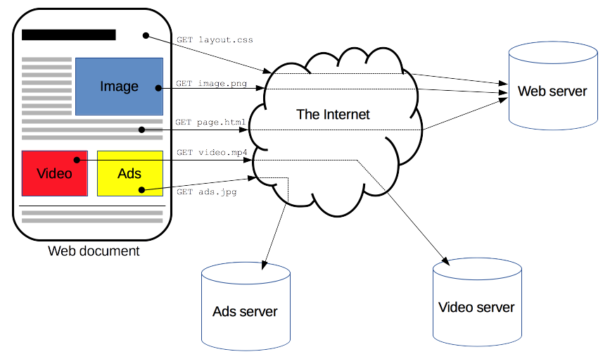

# {{ $frontmatter.title }}

## HTTP

HyperText Transfer Protocol

클라이언트는 서버에게 HTML 파일을 요청(Request), 서버는 응답(Response)

### Request Message

- GET /1.html HTTP/1.1 => 요청행

- Host: localhost:8080 => 네트워크의 컴퓨터 식별하는 이름

- User-Agent : ... => 유저 컴퓨터, 웹브라우저 정보

- Accept-Encoding : gzip, deflate, br => 데이터 양이 많으면 압축해서 전송하는데, 어떤 압축방식을 지원하는지 설명

- If-Modified-Since: => 마지막으로 페이지를 다운받은게 언제인지 확인하여 다시 다운받을지 결정

- `<blank line>` => 블랭크로 헤더와 바디 구분

- Request Message Body

### Response Message

- status : 서버의 응답 결과를 알려줌.

  - version : HTTP 1.1 ...

  - status code : 100, 200, 403, 404,

    [List of HTTP status codes](https://en.wikipedia.org/wiki/List_of_HTTP_status_codes)

### 그 외

- HTTPS, SSL

- Cache

- cookie

- web storage

- proxy
