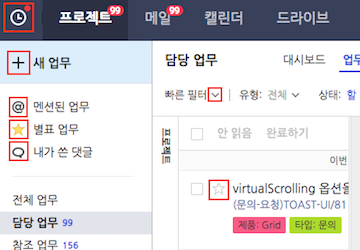
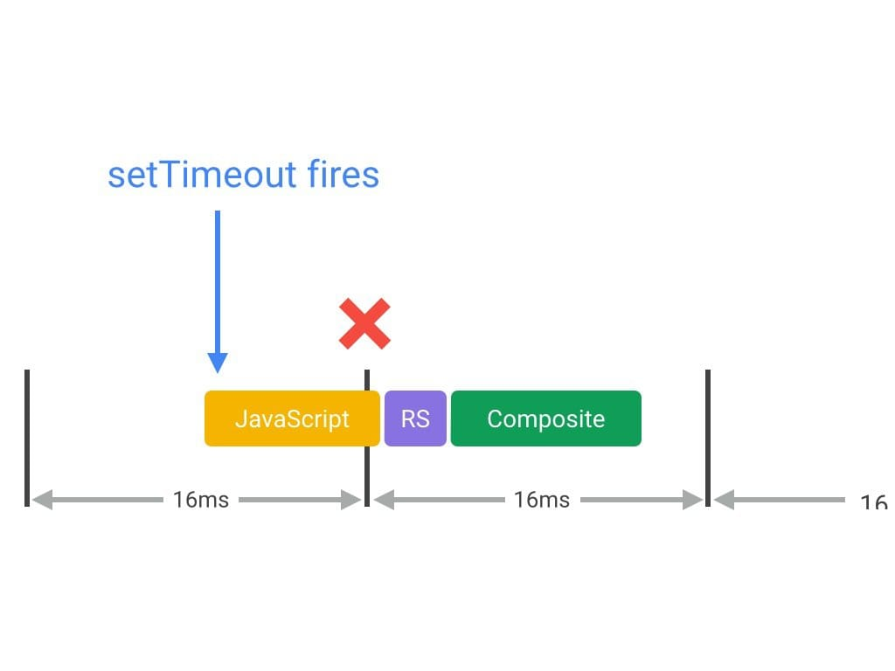

# {{ $frontmatter.title }}

## 성능 측정

### 브라우저 기준

#### **DOMContentLoaded 이벤트**

- HTML과 CSS 파싱이 끝나는 시점

- 렌더 트리를 구성할 준비가 된(DOM 및 CSSOM 구성이 끝난) 상황

#### **load 이벤트**

- HTML 상에 필요한 모든 리소스가 로드된 시점

그리고 이 두 이벤트가 발생하는 시점은 내비게이션 타이밍 API를 사용하거나 크롬 개발자 도구를 통해 확인할 수 있다.

### 사용자 기준


#### **FP(First Paint)**

- 흰 화면에서 화면에 무언가가 처음으로 그려지기 시작하는 순간이다.

#### **FCP(First Contentful Paint)**

- 텍스트나 이미지가 출력되기 시작하는 순간이다.

#### **FMP(First Meaningful Paint)**

- 사용자에게 의미 있는 콘텐츠가 그려지기 시작하는 첫 순간이다. 콘텐츠를 노출하는데 필요한 CSS, 자바스크립트 로드가 시작되고 스타일이 적용되어 주요 콘텐츠를 읽을 수 있다.

#### **TTI(Time to Interactive)**

- 자바스크립트의 초기 실행이 완료되어서 사용자가 직접 행동을 취할 수 있는 순간이다.

[성능 최적화](https://ui.toast.com/fe-guide/ko_PERFORMANCE#%EB%A0%88%EC%9D%B4%EC%95%84%EC%9B%83%EA%B3%BC-%EB%A6%AC%ED%8E%98%EC%9D%B8%ED%8A%B8)

## 로딩 최적화

### 블록 리소스(또는 렌더링 차단 리소스) 최적화

브라우저 로딩 과정에서 파싱 중 블록 리소스가 발생할 수 있다. 블록 리소스에는 CSS 와 JavaScript가 포함된다.

#### CSS 최적화

- DOM 트리는 파싱하면서 순차적으로 구성된다.

- CSSOM 트리는 CSS를 모두 해석해야 구성할 수 있다.

- 즉 CSSOM 트리가 구성되지 않으면 렌더 트리를 만들지 못하고, 렌더링이 차단되어있다.

- 따라서 CSS는 항상 HTML 문서 최상단에 배치하는 것이 좋다.

- 또한 특정 조건(세로 모드, 인쇄 모드 등)에서만 필요한 CSS는, 해당 경우에만 로드할 수 있도록 미디어 쿼리를 사용하여 최적화한다.

  **미디어 쿼리를 사용하지 않는 경우 (최적화 전)**

  ```html
  <link href="style.css" rel="stylesheet" />
  <link href="print.css" rel="stylesheet" />
  <link href="portrait.css" rel="stylesheet" />
  ```

  **미디어 쿼리를 사용하는 경우 (최적화 후)**

  ```html
  <link href="style.css" rel="stylesheet" />
  <link href="print.css" rel="stylesheet" media="print" />
  <link href="portrait.css" rel="stylesheet" media="orientation:portrait" />
  ```

- 외부 스타일시트를 가져올 때 사용하는 `@import` 문은 스타일시트를 병렬로 다운로드 할 수 없기 때문에 로드 시간이 늘어날 수 있다.

#### JavaScript 최적화

- JavaScript는 DOM트리와 CSSOM 트리를 동적으로 변경할 수 있기 때문에 HTML 파싱을차단하는 블록 리소스이다.

- `<script>` 태그를 만나면 스크립트가 실행되며 그 이전까지 생성된 DOM에만 접근할수 있다.

- 그리고 스크립트 실행이 완료될 때까지 DOM 트리 생성이 중단된다.

- 이러한 이유로 JavaScript를 렌더링 차단 리소스라고 한다.

### 리소스 요청 수 줄이기

#### 이미지 스프라이트



- 웹 페이지에서 아이콘 마다 다른 이미지를 사용할 경우 리소스 요청이 아이콘 마다발생

- 여러 아이콘을 묶어 하나의 이미지로 만들고, CSS의 `background-position` 속성을사용해 부분 이미지를 사용하는 방법으로 리소스 요청 수를 줄일 수 있다.

#### CSS, JavaScript 번들링

- 모듈 기반 개발 이전에는 여러 리소스 파일을 분리해서 가져왔었다.

- Webpack, Rollup 등의 번들러를 사용하여 여러 개의 모듈 파일을 하나로 묶어서 1개파일로 만들어 리소스 요청 수를 줄일 수 있다.

#### 내부 스타일 시트 ?

> ☝ 내부 스타일 시트는 리소스 요청 횟수를 줄일 수 있는 방법이지만, 리소스 캐시를 사용할 수 없어서 HTML에 CSS가 매번 포함된다.

#### 작은 이미지를 HTML, CSS로 대체

- 아이콘 이미지 개수가 적은 경우, 이미지를 Base64로 변환한 URI를 사용하여 HTML, CSS에 포함해서 사용할 수 있다.

  ```html
  
  ```

#### 라이브러리의 필요한 함수만 가져오기

```javascript
import _ from 'lodash';

_.array(...);
_.object(...);
```

⇒

```javascript
import array from 'lodash/array';
import object from 'lodash/fp/object';

array(...);
object(...);
```

#### HTML 마크업 최적화

- 중첩을 단순하게 구성한다.

[Avoid an excessive DOM size](https://web.dev/dom-size/)

#### 압축(Minify)하여 사용

- 웹팩 플러그인과 같은 도구의 도움으로 불필요한 주석이나 공백을 모두 삭제하고, 난독화 하는 등 코드의 용량을 압축할 수 있다.

## 렌더링 최적화

### requestAnimationFrame

- 시각적 변화가 브라우저에서 정확한 시간(프레임 시작 시)에 수행되길 원한다.

- 이를 보장하는 유일한 방법은 `requestAnimationFrame` 을 사용하는 것이다.

- `setTimeout` 또는 `setInterval` 은 콜백이 정확한 시간에 수행되는 것을 보장하지않는다.



> ☝ `setTimeout` 과 `setInterval` 의 콜백은 (macro)Task queue 를 사용. `requestAnimationFrame` 은 AnimationFrame 사용.

### 스타일 계산의 범위와 복잡성 줄이기


- DOM 변경, 요소 추가 및 제거, 속성 변경, 클래스 또는 애니메이션은 모두 브라우저가 요소 스타일을 재계산하고 많은 경우에 레이아웃 단계(리플로우)를 거치게 만든다.

- 스타일 계산 단계의 첫 부분은 매칭 선택기 집합을 생성하는 것이다. (요소, 클래스 , ID, pseudo 선택자 등등)

- 스타일 계산의 두 번째 단계는 매칭된 선택기에서 스타일 규칙을 가져와서 요소의마지막 스타일을 계산하는 과정이 포함된다.

- 따라서 선택기의 복잡성을 줄이고 (BEM 등의 방법론 적용) 스타일을 계산해야 하는요소의 수를 줄여야 한다.

### 크고 복잡한 레이아웃 및 스래싱 피하기

- 레이아웃의 범위는 일반적으로 전체 문서로 지정된다.

  - 너비, 높이, 왼쪽 또는 상단 등 **"기하학적 속성"**의 변경은 모두 레이아웃이필요하다.

  - `flexbox` 를 사용한 레이아웃이 `float` 를 사용한 레이아웃 보다 비용이 적다.

- DOM 요소의 수는 성능에 영향을 주므로 가급적 레이아웃 트리거를 피해야 한다.

- 강제 동기식 레이아웃 및 레이아웃 스래싱을 피해야 한다.

  > ☝ 원래 레이아웃은 비동기이나, 특정 상황에서 동기적으로 레이아웃이 발생할 수있다. 이것을 강제 동기식 레이아웃 이라 한다.

  ```javascript
  function logBoxHeight() {
  	box.classList.add('super-big');

  	// Gets the height of the box in pixels
  	// and logs it out.
  	console.log(box.offsetHeight);
  }
  ```

  - 위의 함수는 스타일을 변경한 후에, 높이를 요청한다.

  - 높이를 구하는 것 역시 레이아웃을 실행해야 하는 것이다.

  - 스타일 계산과 레이아웃을 동시에 실행하면 잠재적 병목 현상이 발생할 수 있으므로 일반적으로 바람직하지 않다.

  ```javascript
  function resizeAllParagraphsToMatchBlockWidth() {
  	// Puts the browser into a read-write-read-write cycle.
  	for (var i = 0; i < paragraphs.length; i++) {
  		paragraphs[i].style.width = box.offsetWidth + 'px';
  	}
  }
  ```

  - 위의 함수는 각 루프의 반복이 스타일 값 `box.offsetWidth` 를 읽은 다음, 즉시 `paragraphs[i].style.width` 를 업데이트 한다.

  - 이전 반복에서 레이아웃이 변경되었기 때문에 `box.offsetWidth` 을 조회하는 것역시 강제 동기식 레이아웃을 유발한다. 이를 아래와 같이 수정할 수 있다.

  ```javascript
  // Read.
  var width = box.offsetWidth;

  function resizeAllParagraphsToMatchBlockWidth() {
  	for (var i = 0; i < paragraphs.length; i++) {
  		// Now write.
  		paragraphs[i].style.width = width + 'px';
  	}
  }
  ```

### 페인트 복잡성 단순화 및 페인트 영역 줄이기

- `transform` 또는 `opacity` 를 제외한 모든 속성 변경은 항상 페인트를 트리거 한다.

- 가능한 하위 노드의 DOM을 조작하고 스타일을 변경

  - DOM이 작고 깊이가 얕을수록 계산이 빠르다.

  - 불필요한 래퍼 엘리먼트를 제거한다.

- 영향 받는 엘리먼트 제한
