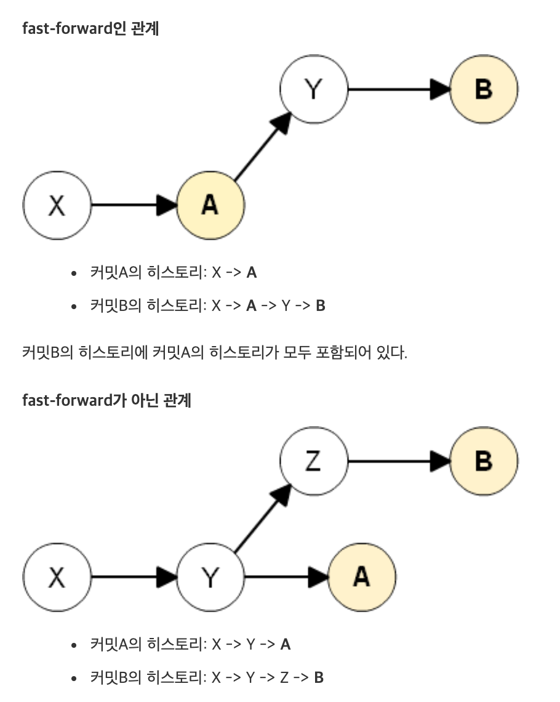

# {{ $frontmatter.title }}

## 빈 브랜치 생성하기

```bash
git checkout --orphan empty-branch
```

```bash
git rm -rf .
```

```bash
git commit --allow-empty -m "Initial commit"
```

## Git Pull 전략

`git pull` 을 별도 옵션 없이 실행했을 때 경고 문구가 나타났다.

```bash
warning: Pulling without specifying how to reconcile divergent branches is
discouraged. You can squelch this message by running one of the following
commands sometime before your next pull:

git config pull.rebase false  # merge (the default strategy)
git config pull.rebase true   # rebase
git config pull.ff only       # fast-forward only

You can replace "git config" with "git config --global" to set a default
preference for all repositories. You can also pass --rebase, --no-rebase,
or --ff-only on the command line to override the configured default per
invocation.
```

- default (merge) : 로컬 브랜치와 리모트 브랜치의 Head가 다른 위치에 있을 때, `pull` 받으면, Merge 커밋을 생성함.

- rebase : 로컬 브랜치와 리모트 브랜치의 Head가 다른 위치에 있을 때, `pull` 받으면, 리모트 브랜치를 `rebase` 하여 history를 정리함.

- fast-forward only : fast-forward 관계에 있을 때만 `pull` 을 허용함.



[Git - git-pull Documentation](https://git-scm.com/docs/git-pull)

[[GIT] Git pull 전략 (default, --ff -only, --rebase)](https://sanghye.tistory.com/43)

[GitHub 환경에서의 실전 Git 레시피 : NHN Cloud Meetup](https://meetup.toast.com/posts/116)

## Conventional Commit

[Conventional Commits](https://www.conventionalcommits.org/en/v1.0.0/)

[Git commit 메세지 규약 - Conventional Commits](https://medium.com/hashbox/git-commit-%EB%A9%94%EC%84%B8%EC%A7%80-%EA%B7%9C%EC%B9%99-conventional-commits-71710f7f53c)
