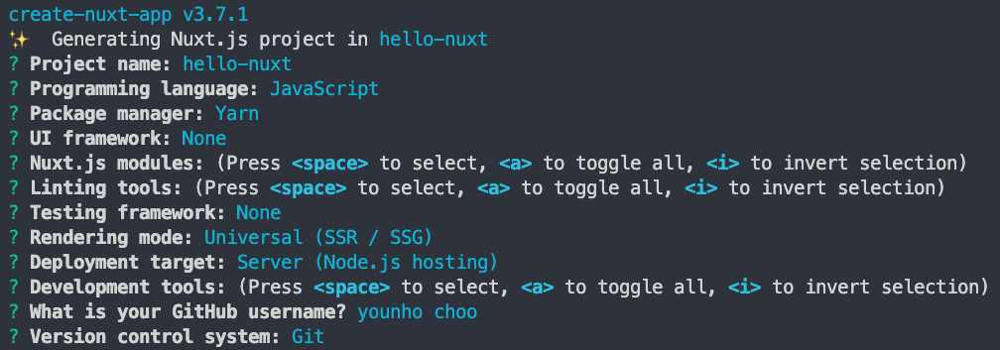

# {{ $frontmatter.title }}

## yarn run vs npm run

### [yarn run [script] [\<args\>]](https://classic.yarnpkg.com/en/docs/cli/run#toc-yarn-run-script)

- `scripts` 에 등록된 명령어 실행
- `node_modules/.bin/`에 위치한 실행 가능 파일(executable) 실행
- `run` 은 생략 가능하다.

### [npm run-script \<command\>](https://docs.npmjs.com/cli/v7/commands/npm-run-script)

- `npm run <command>` 로 alias
- `scripts` 에 등록된 명령어 실행

### [npm exec (npx)](https://docs.npmjs.com/cli/v7/commands/npx)

1. `node_modules/.bin` 에 위치한 실행 가능 파일(executable) 실행
2. remote npm package 실행

## nuxt 프로젝트 생성

```
yarn create nuxt-app
```

`create-nuxt-app` 을 사용하면 cli를 통해 프로젝트에 관한 설정에 대한 질의를 한다 .


