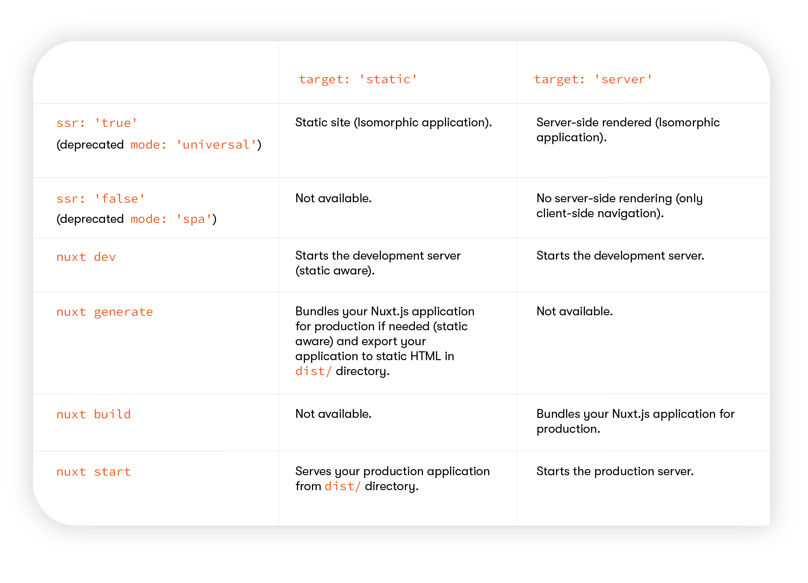

<Metadata />

## Nuxt.js 공식 문서 Concept - View 파트 정리

Nuxt.js의 View는 `app template`과 `Layout`, `Page`로 구성된다. SEO 최적화를 위해페이지 별로 meta 태그와 head 섹션을 구성할 수 있다.

### Pages

모든 페이지 컴포넌트는 뷰 컴포넌트이다. 하지만 Nuxt.js는 쉽게 개발할 수 있도록특별한 속성들과 함수들을 추가한다.

> 모든 페이지 속성을 보려면 [Directory Structure](https://nuxtjs.org/docs/2.x/directory-structure/pages)를참고

### Layouts

레이아웃은 Nuxt.js 앱의 Look & Feel을 변경할 때 유용하다. (예를 들어 사이드바)

레이아웃은 `layouts` 디렉토리에 추가한다.

`default.vue` 파일은 기본 레이아웃을 정의한다.

```html
<!-- layouts/default.vue -->
<template>
	<Nuxt />
</template>
```

> 레이아웃에는 `<Nuxt />` 컴포넌트를 반드시 추가해야 한다.

기본 레이아웃 외의 커스텀 레이아웃은 `layouts` 폴더에 다른 이름으로 파일을 생성하여 만들 수 있다.

```html
<!-- layouts/blog.vue -->
<template>
	<div>
		<div>My blog navigation bar here</div>
		<Nuxt />
	</div>
</template>
```

이렇게 생성한 레이아웃을 사용하려면, `page` 컴포넌트에서 `layout` 속성에 파일 이름을 값으로 사용하면 된다.

```html
<!-- pages/posts.vue -->
<template>
	<!-- Your template -->
</template>
<script>
	export default {
		layout: 'blog',
		// page component definitions
	};
</script>
```

### Error Page

에러 페이지는 에러가 발생할 때(`404`, `500`, 등등) 표시되는 페이지 컴포넌트이다.

에러 페이지는 레이아웃이지만, 에러가 발생할 때 표시되는 특별한 컴포넌트로 봐야한다. 따라서 다른 레이아웃 컴포넌트와 달리 `<Nuxt />` 컴포넌트를 포함해선 안되고 , `layouts` 디렉토리에 위치해야 한다. 다른 페이지 컴포넌트처럼 다른 레이아웃을사용할 수 있다.

```html
<!-- layouts/error.vue -->
<template>
	<div>
		<h1 v-if="error.statusCode === 404">Page not found</h1>
		<h1 v-else>An error occurred</h1>
		<NuxtLink to="/">Home page</NuxtLink>
	</div>
</template>

<script>
	export default {
		props: ['error'],
		layout: 'error', // you can set a custom layout for the error page
	};
</script>
```

### Document: App.html

App 템플릿은 head와 body에 대한 컨텐츠와 변수를 주입하는 Nuxt.js 애플리케이션의실제 HTML 프레임을 만드는데 사용된다.

이 파일은 자동적으로 생성되고, 일반적으로 수정할 필요가 거의 없다.

한 가지 사용 예시는 IE에 대한 조건부 CSS 대응이다.

```html
<!-- app.html -->
<!DOCTYPE html>
<!--[if IE 9]><html class="lt-ie9 ie9" {{ HTML_ATTRS }}><![endif]-->
<!--[if (gt IE 9)|!(IE)]><!--><html {{ HTML_ATTRS }}><!--<![endif]-->
	<head {{ HEAD_ATTRS }}>
		{{ HEAD }}
	</head>
	<body {{ BODY_ATTRS }}>
		{{ APP }}
	</body>
</html>
```

[Nuxt.js 공식 문서](https://nuxtjs.org)의 [Rendering](https://nuxtjs.org/docs/2.x/features/rendering-modes)과 [Deployment Target](https://nuxtjs.org/docs/2.x/features/deployment-targets) 부분을 읽으면서 `nuxt.config.js`의 `ssr: 'true'`와 `target: 'server'`의 차이가 무엇인지 헷갈렸다.

static site를 만들기 위해서는 `target: 'static'`과 `ssr: 'true'`를 활성화 해야한다. `mode: 'universal'`는 같은 기능이지만, deprecated 되었다.

`ssr: 'true'`이 기본값이다.

`ssr: 'false'`는 `mode: 'spa'`와 같은 기능이지만 deprecated 되었다. `ssr: 'false'`는 `target: 'static'`과 함께 사용할 수 없다.

Nuxt.js에는 몇 가지 명령어가 있는데, `target` 값에 따라서 가능 여부가 달라진다.

아래의 표가 속성 값에 따른 명령어에 대한 기대 동작을 잘 설명해준다.



### 참고자료

- [Demystify Nuxtʼs target, mode, and ssr properties](https://kontent.ai/blog/demystify-nuxt-target-mode-and-ssr-properties) [Going Full Static](https://nuxtjs.org/blog/going-full-static)
- [Nuxt.js - Concept/Views](https://nuxtjs.org/docs/2.x/concepts/views)
