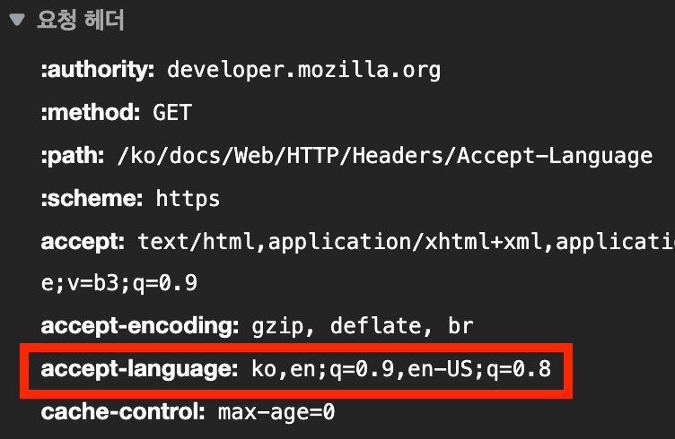

<Metadata />

- `Accept-Language` 요청 HTTP 헤더는 어떤 언어를 클라이언트가 이해할 수 있는지, 그리고 지역 설정 중 어떤 것이 더 선호되는지를 알려준다.
- `en;q=0.9` 는 영어의 가중치가 0.9 라는 뜻이다. 기본 가중치는 1이다.
- [[window.navigator.language|`window.navigator.language`]]와의 차이가 있다고 하지만, Edge에서 테스트 해봤을 땐 차이가 없었다.

## Related

- [[HTTP-헤더|HTTP 헤더]]
- [[HTTP-Request|HTTP Request]]
- [[Content-Language]]
- [[window.navigator.language]]
- [[다국어-사이트를-디자인하거나-개발할-때-주의해야-할-사항|다국어 사이트를 디자인하거나 개발할 때 주의해야 할 사항]]

## References

- [Accept-Language - HTTP | MDN (mozilla.org)](https://developer.mozilla.org/ko/docs/Web/HTTP/Headers/Accept-Language)
- [javascript - Browser language detection: inconsistency between user agent and window.navigator.language - Stack Overflow](https://stackoverflow.com/questions/23415391/browser-language-detection-inconsistency-between-user-agent-and-window-navigato?rq=1)
