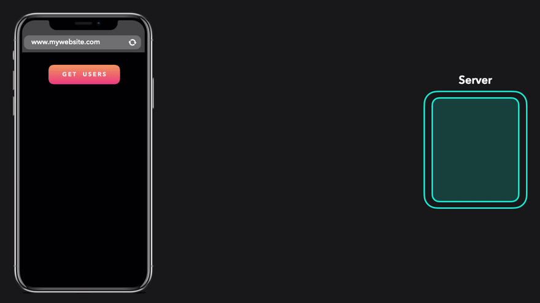
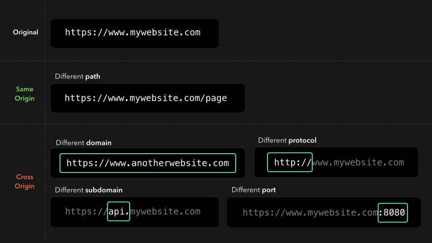
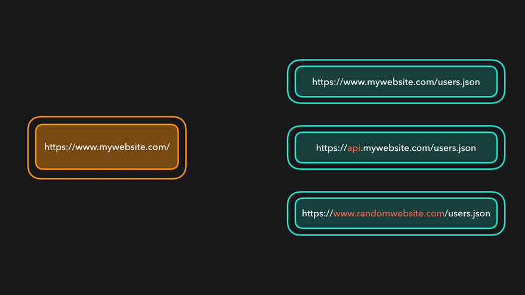
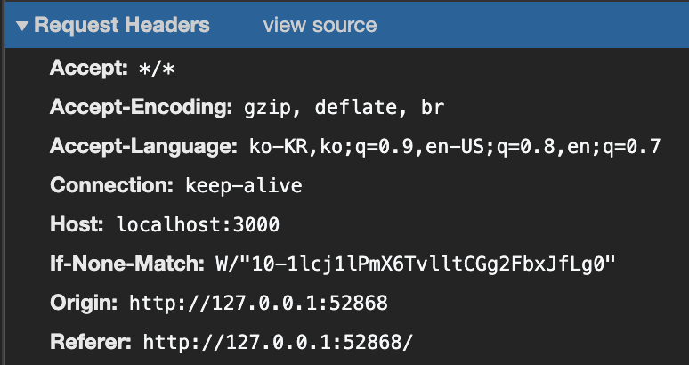
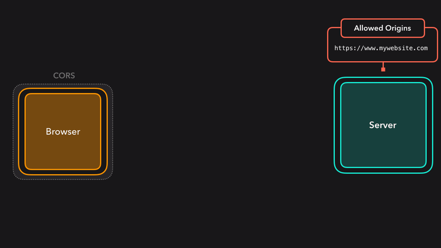
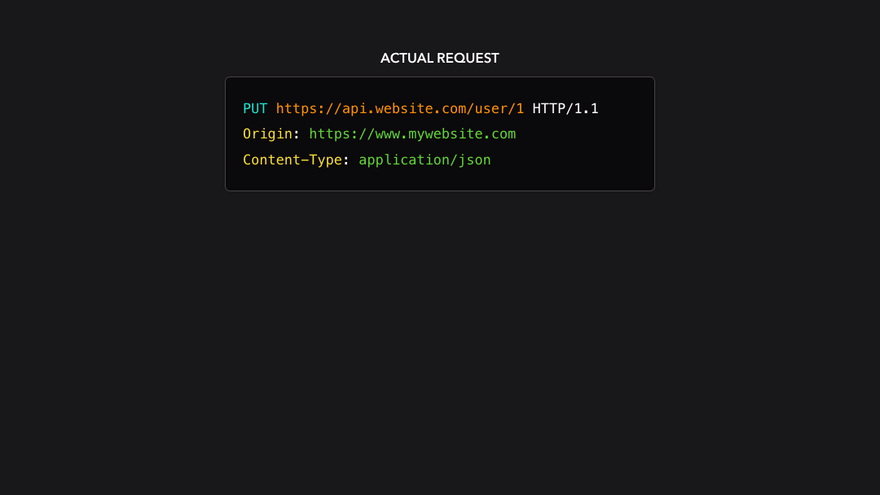
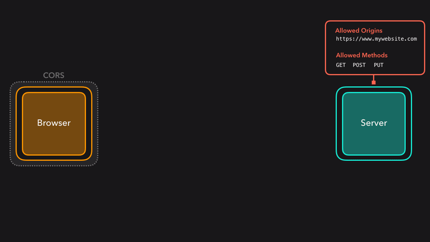
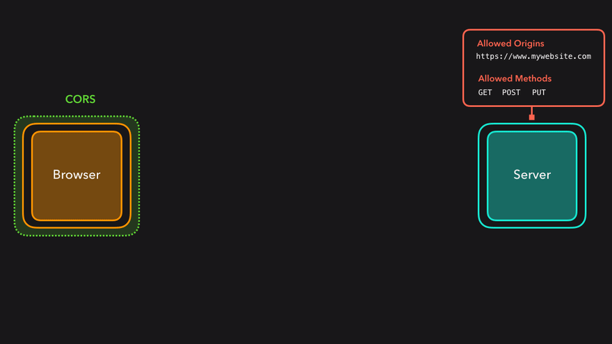

<Metadata />

## 배경

프론트엔드에서 데이터를 보여주기 위해서는 여러 서버의 자원을 요청(request)하게된다. (`image` , `css` , `js` , `json` ...)



기본적으로 모든 HTTP 요청은 Cross-Site HTTP Request가 가능하다. 즉 `` 태그의 `src` 속성, `<link>` 태그의 `href` 속성, `<script>` 태그의 `src` 속성으로 [[크로스-사이트(Cross-Site)|크로스 사이트(Cross Site)]]의 자원을 가져와서 사용하는 것이 가능하다.

하지만 `<script>` 태그 내에서 즉, **스크립트 내에서 생성된 HTTP Request**에 대해서는 [[동일-출처(Same-Origin)|동일 출처 정책(Same Origin Policy)]]이 적용된다.

즉 CORS 정책은 [[교차-출처(Cross-Origin)|교차 출처(Cross Origin)]] 에서 가져온 리소스를 제한하는 보안 방식이다.

### Origin 이란?



여기서 [[출처(Origin)]]란 프로토콜, [[도메인(Domain)|도메인(서브 도메인 포함)]], 포트번호까지 모두 합친 것을 의미한다.

> 브라우저 콘솔에서 `location.origin` 으로도 접근할 수 있다.



즉 도메인, 프로토콜, 포트번호까지 모두 같아야 동일 출처로 인정되는 것이다.

### Cross Origin

그러면 스크립트 내에서는 같은 출처에 있는 자원만 요청하고, 사용할 수 있는가? 아니다. AJAX가 널리 사용되면서 `<script>` 내부에서도 Cross-Site HTTP Request가 가능해야 한다는 요구가 늘어나면서 [[W3C]]로부터 CORS(Cross Origin Request Sharing) 라는 권고안이 나오게 되었다.

#### 브라우저 (Client-Side)

브라우저는 스크립트 내의 다른 출처에 대한 HTTP Request Header에 `Origin` 이라는필드를 추가해서 요청을 보낸다.

크롬 네트워크 탭에서 Request Header를 살펴보자. (서버 : `http://localhost:3000` )

- Cross Origin

  

- Same Origin

  

- `<script>` 태그 외부의 `request`

  

> ☝ Cross Origin 요청에만 Origin 필드가 추가된 것을 볼 수 있다.

#### 서버 사이드

서버에서 교차 출처 요청을 허용해주기 위해서 HTTP response에 `Access-Control-Allow-*` 옵션들을 사용할 수 있다.

서버는 `Access-Control-Allow-Origin` 헤더로 어느 출처를 허용할 것인지 명시할 수있다.

```js
// express에서의 예시

// 전체 허용
res.header('Access-Control-Allow-Origin', '*');
// 특정 출처 허용
res.header('Access-Control-Allow-Origin', 'http://example.com');
```



또한 `Access-Control-Allow-Methods` 로 허용할 메소드들을 지정할 수 있다.

```js
res.header('Access-Control-Allow-Methods', ['POST', 'GET', 'PUT']);
```

### Preflighted Requests

CORS에는 두 가지 유형의 요청이 있다. **단순 요청(Simple Request)과 프리플라이트 요청(Preflighted Request)** 이다.

프리플라이트 요청은 서버 데이터에 [[부수-효과(Side-Effect)|부수 효과(Side Effect)]]를 일으킬 수 있는 HTTP 요청 메서드에 대해 `OPTIONS` 메서드로 지원하는 메서드를 요청하고, 서버의 허가가 떨어지면 **실질적 요청(Actual Request)** 을 보내는 기법이다.

#### Simple Request

simple request는 다음 조건을 만족해야 한다.

- `GET`, `POST` 메소드 + (`HEAD` 메소드)
- `POST` 방식일 경우 [[Content-Type]]이 아래 셋 중 하나
  - `application/x-www-form-urlencoded`
  - `multipart/form-data`
  - `text/plain`
- 커스텀 헤더를 전송하지 말아야 한다.

> 자세한 조건은 MDN 문서를 참조한다.
>
> [교차 출처 리소스 공유 (CORS)](https://developer.mozilla.org/ko/docs/Web/HTTP/CORS#접근_제어_시나리오_예제)

#### Preflighted Request



preflighted request는 **실질적 요청(actual request)**을 보내기 전에 `Access-Control-Request-*` 헤더를 사용해 미리 요청을 보낸다.



브라우저는 서버로부터 받은 응답을 보고, 허용되었다면 실질적 요청을 보내게 된다.



만약 preflighted request가 허용되지 않았다면 브라우저는 실질적 요청을 전송하지않게 된다.

이러한 방법을 통해 서버는 허용하지 않은 출처로부터의 자원에 대한 접근이나 수정을막아 보호를 받게 된다.

### 참고자료

- [✋🏼🔥 CS Visualized: CORS](https://dev.to/lydiahallie/cs-visualized-cors-5b8h)
- [동일 출처 정책 (Same Origin Policy)](https://developer.mozilla.org/ko/docs/Web/Security/Same-origin_policy)
- [교차 출처 리소스 공유 (CORS) - HTTP | MDN (mozilla.org)](https://developer.mozilla.org/ko/docs/Web/HTTP/CORS)
- [Cross Origin Resource Sharing - CORS](http://homoefficio.github.io/2015/07/21/Cross-Origin-Resource-Sharing/)
