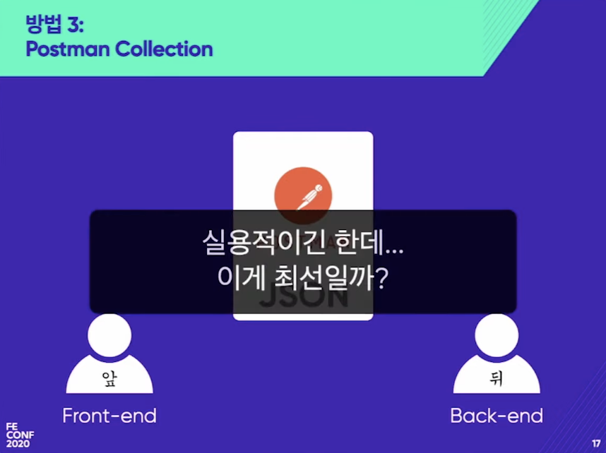
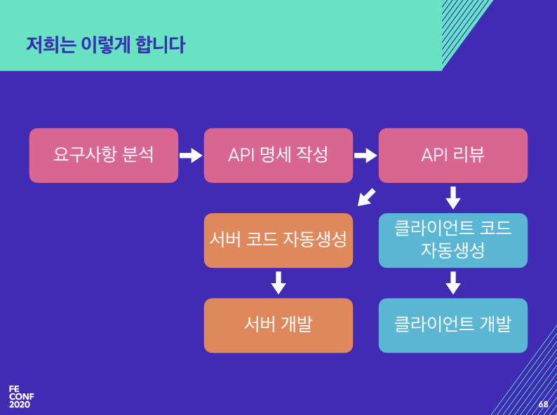

- [발표자료](https://drive.google.com/file/d/1ZrP6yBdGJTDXZuX67TU0aVaSrF_AgQe6/view)

## OpenAPI Specification?

> OpenAPI Spec(OAS)이라고 하기도 함

- REST API를 위한 것.
  - GraphQL이 핫한 건 알지만 ...

풀스택 개발자 : API 스펙은 제 머리 속에 다 있어요. -> 언젠가 인수인계는 해야하지 않을까요?

### API 스펙을 공유하는 방법

1. 구두로 전달하기

2. 공동 편집 문서 (위키, Google Docs)

- 유지보수가 안되는 경우가 많다.

3. Postman Collection

### API 함수의 타입을 어떻게 정의하나요? (TypeScript)

- 타입을 손으로 하나하나 정의한다.

  - 개발자가 가장 싫어하는 단순 반복
    - 타입스크립트 귀찮고 짜증난다.

- API 스펙을 파일로 공유받고, 스크립트를 돌리면 API 인터페이스 함수를 담고 있는 클래스와 리턴 타입 객체 인터페이스가 자동으로 만들어진다면 ?
  - 이런 것을 해주는 것이 [OpenAPI Specification](https://www.openapis.org/)이고 OpenAPI Generator를 사용해서 가능하다.

### OpenAPI Spec

- [Home - OpenAPI Initiative (openapis.org)](https://www.openapis.org/)
- [OAI/OpenAPI-Specification: The OpenAPI Specification Repository (github.com)](https://github.com/OAI/OpenAPI-Specification)
- (구) Swagger Specification
- OpenAPI Initiative(OAI)에서 관리
  - 리눅스 재단 오픈소스 협업 프로젝트
- JSON / YAML로 API 스펙 명시

## OAS 희망편

- 개발자에게 매력적인 기능 제공
- 기계가 이해할 수 있는 API 명세
  - API가 JSON or YAML 객체 형태
  - API 작성을 돕는 도구
    - Swagger Editor
    - 에디터 플러그인 (VS Code, WebStorm ...)
  - API 확인을 돕는 도구
    - Redoc
  - Postman Collection으로 변환해서 가져오기 가능
    - API 요청 및 응답 확인 가능
  - OpenAPI Generator
    - Mustache 템플릿 기반 코드 자동 생성
- 프론트엔드 개발자에게 편의 제공

  - 백엔드 개발자
    - API 기반 서비스 클래스 뼈대 자동 생성
    - API-First Development
  - 프론트엔드 개발자
    - API 통신 함수 자동 생성
      - fetch / axios 호출을 직접 짜지 않아도 된다.
    - API 요청 / 응답에 사용되는 데이터의 TypeScript 타입 정의 자동 생성
    - 예시 결과를 리턴하는 stub 서버 코드 자동 생성
    - "서버 개발이 안 끝나도 개발할 수 있어요"

- 사람이 짜는 코드 양이 줄어들면 무엇이 좋아지나요?
  - 비즈니스 로직이나 뷰를 짤 시간이 증가
  - 휴먼 에러 감소
    - API 주소 오타
    - 타입 정의 오류
- API 호출 함수의 타입이 자동으로 정의된다.
  - 함수에 넣는 매개변수의 타입 검사
    - Type Safety
  - 객체 내 프로퍼티 목록 확인 / 자동완성
  - 코드 내비게이션을 통한 코드베이스 학습 비용 감소

### 어떻게 설득할 것인가?

- 서버 개발자가 느끼는 장점
  - Postman Collection 자동 생성
  - Swagger-codegen / openapi-generator의 강력한 자바 지원
    - 서버 간 통신 클라이언트 자동 생성
    - [API 서비스 코드를 위임 형태로 구현](https://www.jhipster.tech/doing-api-first-development/)
    - 각종 타입 인터페이스 자동 생성
    - 응답에 값을 잘 넣어주고 있는지 확인 가능

### 희망편 결론

안전한 코드를 빠르게 만들 수 있다.

## ~~절망편~~ 실전편

> 스펙은 죄가 없다. 작성자와 제너레이터의 문제가 있을 뿐.

### 스펙 작성의 걸림돌

- "자 여러분! API 명세를 처음부터 끝까지 문서화해볼까요?"
  - 하시겠습니까?

1. 고생하더라도 직접 쓰기
2. ~~돌아갈 길을 찾기~~

> 고생하더라도 직접 써야 한다.

- 스펙에서 코드를 만들 듯, 서버 코드(특히, Spring Boot)에서 스펙을 만들 수 있다.
  - 생각보다 퀄리티가 괜찮다.
- 하지만 이는 여러모로 위험하다.
  - 서버 개발자가 코드 한 줄 한 줄이 자동 생성된 스펙에 큰 영향을 끼칠 수 있다는 것을 인지해야 한다.
  - 코드 변경 시 스펙 파일이 요동친다.
  - 언어 특성상 잘 번역이 안되는 경우도 많다.

### OpenAPI Generator의 문제점

- 하나의 Spec으로 모든 언어에 대한 API 템플릿을 생성해준다??
  - 이걸 실제로 다 지원하는가?
- OpenAPI Generator의 템플릿 관리
  - 

## 결론

## References

- [[B2] OpenAPI Specification으로 타입-세이프하게 API 개발하기: 희망편 VS 절망편 - YouTube](https://www.youtube.com/watch?v=J4JHLESAiFk)
- [발표자료](https://drive.google.com/file/d/1ZrP6yBdGJTDXZuX67TU0aVaSrF_AgQe6/view)
