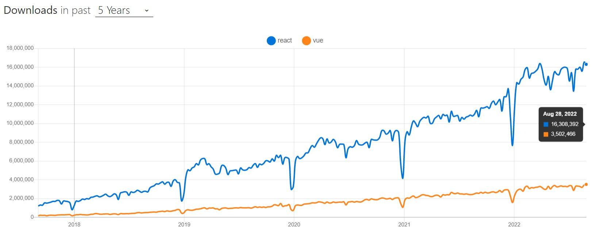

## React 유저에게 Vue 사용을 가로막는 것

<iframe src="https://twitframe.com/show?url=https://twitter.com/antfu7/status/1567511783832961026" width="550" height="385" style="max-width: 100%;" scrolling="no"></iframe>

::: tip
[Anthony Fu](https://antfu.me/)는 Vue, Nuxt, Vite 팀의 코어 멤버이며, Vitest, VueUse, UnoCSS, Slidev의 저자입니다.

그가 남긴 질문에 300개가 넘는 의견들이 있었고, 개인적으로 인상적인 답변을 모아 정리하였습니다.
:::

### 1. 생태계(Ecosystem)

- Migrate from v2 to v3
  - [Vue 3로 마이그레이션하는 과정에서 많은 프로젝트가 정체되면서 커뮤니티가 어려움을 겪고 있다.](https://twitter.com/david_welch/status/1567578569018331136)
  - [v2 to v3로 이미 취약한 생태계가 더욱 황폐해졌다.](https://twitter.com/FarSideOfMoonvy/status/1567564873315536897)
  - [유지 관리되지 않는 라이브러리 - Vue 3가 아닌 Vue 2만 지원하는 경우가 많다.](https://twitter.com/songkeys/status/1567537487278637058)
  - [React의 발전 속도가 훨씬 빠르다. Vue 3가 프로덕션에 안전한 버전이 되기까지 너무 오랜 시간이 걸렸다.](https://twitter.com/vedovelli74/status/1567536389452976138)
- Production Ready Frameworks
  - [Next.js는 여전히 Nuxt보다 앞서 있다.](https://twitter.com/donutspree/status/1567523725091786759)
  - [Next.js는 안정적이지만, Vue 3 기반인 Nuxt 3는 아직 RC 버전이다.](https://twitter.com/pawelblaszczyk_/status/1567530464881025030)
    - [Vue를 선호하는 사용자에게도 v2.7 이상, VueUse & script setup 사용 여부는 기본적으로 요구된다.](https://twitter.com/milosdim018/status/1567538261211455494)
  - [React는 Next.js 외에도 Blitz, Remix, Fusion, Gatsby 등 다양한 프레임워크가 경쟁하지만, Vue에는 Nuxt외에 성숙한(mature) 대안이 없다.](https://twitter.com/NoWizardry/status/1567552749033902080)
  - [적절한 대안이 없는 상황에서 2년 동안의 긴 Nuxt 3 개발 기간은 사람들을 걱정하게 만들었다.](https://twitter.com/aareksio/status/1567570632501608449)
- Libraries
  - React 생태계의 다양한 라이브러리가 언급되었는데, 그 중 중요하게 언급된 것들은 아래와 같다.
  - [Radix UI](https://twitter.com/fictionlul/status/1567568518534627329)
  - [swr](https://swr.vercel.app/), [react-query](https://react-query-v3.tanstack.com/)
  - [GraphQL (apollo)](https://github.com/vuejs/apollo)
  - [Framer Motion](https://www.framer.com/motion/)
    - [[Framework-Agnostic|프레임워크에 구애받지 않는]] [MotionOne](https://motion.dev/), [GSAP(greensock)](https://greensock.com/gsap/) 등이 있지만, Framer Motion은 React와 긴밀히 통합되어 멋진 선언적 API를 제공한다.
  - React Native
- Majority & Popularity & Market
  - 
  - [React 유저에게 Vue 사용/전환의 명확한 이점이 없으므로 가장 인기 있는 것을 사용한다.](https://twitter.com/LuisMartinezSu2/status/1567527428196540417)
  - [모든 라이브러리가 문서 관점에서 React에 더 의존한다. React를 먼저 지원하고, 첫 번째 예제로 React를 사용하며, React 튜토리얼은 어디에나 있다.](https://twitter.com/hd_nvim/status/1567534338081755137)
    - [거의 모든 도구는 먼저 React를 지원한다.](https://twitter.com/saameeey/status/1567575849955692546)
  - 고용 관점
    - https://twitter.com/tompischulski/status/1567530275986456578
    - https://twitter.com/_teo_garcia/status/1567530331254685698

### [2. TypeScript support & Editor experience](https://twitter.com/ragragg_/status/1567537229043572737)

- Vue는 v3부터 TypeScript 지원이 강화되었고, [Volar](https://github.com/johnsoncodehk/volar)를 사용하여 VS Code에서 더 나은 경험을 제공한다.
  - [Volar의 이슈 히스토리를 보면, 한 사람의 메인테이너가 Vue + TS를 이끄는 것에 염려가 있다.](https://twitter.com/NikhilVerma/status/1567904980212027392)
  - [대규모의 프로젝트에서 성능 이슈가 있다.](https://twitter.com/jaredmcateer/status/1568826905155219457)
- [TypeScript를 지원하지 않는 라이브러리가 너무 많다.](https://twitter.com/trymbill/status/1567569434130403328)

### 3. 그 외

- template vs JSX
  - React는 더 낮은 수준이고 바닐라 JS에 더 가깝다.
  - [template 문법은 불필요한 DSL이다.](https://twitter.com/martinmalindacz/status/1567512773734563841)
    - [[Domain-specific-language|DSL(Domain Specific Language)]]
  - [JSX는 JavaScript용 구문적 설탕이기 때문에, JS로 컴파일하는 언어(ex: clojurescript, rescript, purescript)를 사용하여 React와 함께 작업할 수 있다. Vue가 다른 언어와 통합되는 것은 거의 불가능하거나 쉽지 않은 것 같다.](https://twitter.com/TunkShif/status/1567566536679854081)
  - [이상한 추상화 (마법 문자열)](https://twitter.com/akwesi_ansah/status/1567531909814550529)
  - [문자열 템플릿은 TypeScript 세계에서 적절하지 않다고 느꼈다.](https://twitter.com/parasocialML/status/1567541122792308736)
- [Vue의 API가 너무 많다.](https://twitter.com/didan64037534/status/1567536388463276033)
- [너무 많은 키워드를 기억해야 한다.](https://twitter.com/quanruzhuoxiu/status/1567531726108512257)
- [[변성(Mutable)-vs-불변성(Immutable)|불변의 개념]]
- [Vue의 양방향 바인딩으로 인해 비즈니스 로직이 Vue 프레임워크와 결합된다.](https://twitter.com/NickOlszanski/status/1567586724208844803)
- [React는 뷰 레이어에 더 집중하고, Vue는 MVVM 패턴으로 뷰 레이어보다 더 많은 일을 한다.](https://twitter.com/_TbhT_/status/1567699635669696512)
- [시도할 이유가 없다.](https://twitter.com/Maplethorpej/status/1567541962252906498)

### Vue 유저 관점에서의 장점

- [React hooks의 정신적 부담(mental burden)](https://twitter.com/antfu7/status/1567527559574994946)
  - [useEffect를 다루는 것은 어려우며, cleanup function을 잊기 쉽다.](https://twitter.com/hd_nvim/status/1567536738804842496)
  - ["How useEffect works"에 대한 유튜브 동영상이 너무 많다!](https://twitter.com/milosdim018/status/1567538919171825670)
- [반응형 시스템](https://twitter.com/c_hartinger/status/1567534378762338309)
- [단일 파일 컴포넌트](https://twitter.com/mattaningram/status/1567563160369995777)
- [Vue 생태계는 React보다 모든 프레임워크를 위한 도구 체인을 더 많이 제공한다. Vite, Vitest](https://twitter.com/sadeghbarati5/status/1567560996188741632)
- [평균 프론트엔드 개발자보다 HTML/CSS를 더 잘 아는 사람들에게 적합하다.](https://twitter.com/mattaningram/status/1567564998750228480)

## Thoughts

- 두 프레임워크 모두 웹 애플리케이션을 제작하기에 충분히 성숙한, 훌륭한 프레임워크이다.
- 생태계 관점
  - Vue는 어느 기업에도 의존하지 않는다.
  - React는 Meta(구: Facebook)의 주도로 빠르게 발전한다.
- 진입 장벽 or 러닝 커브 관점
  - React
    - 특히 Hooks와 관련된 "멘탈 모델"을 확립하는 것이 중요하다.
    - 또한, React는 UI를 만드는 부분만 담당하기 때문에 전역 상태 관리, 라우팅, 데이터 페칭, Scoped CSS 등에 서드 파티 라이브러리를 사용해야 한다.
      - 서드 파티 라이브러리가 많기 때문에 이를 학습하는 비용이 있을 수 있다.
    - 신규 기능이 Vue에 비해 빠르게 추가된다.
  - Vue
    - 라이프사이클, 디렉티브, 믹스인 등 활용할 수 있는 다양한 옵션들이 많이 존재한다.
    - Vue에서는 자체 Scoped CSS 기능이 있고, 공식적으로 관리하는 라우터, 상태 관리 등의 라이브러리가 존재한다.
      - 일관되게 사용할 수 있다.
      - 더 적은 수의 라이브러리에 의존할 수 있다.
- 데이터 바인딩
  - React
    - 데이터(props, state)가 바뀌면 View를 새로 렌더링하는 방식
  - Vue
    - 인스턴스의 데이터가 변경되었을 때, 데이터를 업데이트해서 렌더링
      - [[v-model]]
  - 느낌
    - React는 상태 변경마다 컴포넌트를 렌더링하기 때문에, 함수의 의존성(props)에 따라 최적화해주는 작업들이 조금 번거로울 수 있다.
      - useEffect, useCallback, React.memo
    - [[React-Hooks|React Hooks]] 멘탈 모델을 확립하는 것
      - React Hooks에 대해 잘못 이해하고 사용할 수 있다.
      - 멘탈 모델을 확립하면 라이프사이클에 의존하지 않고 개발할 수 있어서 편하다.
      - Hooks를 통해 컴포넌트 사이에서 상태 로직을 재사용할 수 있다.
- React 생태계에는 [radix-ui](https://www.radix-ui.com/), [react-aria](https://react-spectrum.adobe.com/react-aria/) 등 접근 가능한 컴포넌트(Accessible Components)를 만드는데 도움이 되는 라이브러리가 풍부하다.
  - Vue 생태계에서 [[Headless-UI|Headless / Unstyled UI]]로 선택할 수 있는 것은 [Headless UI](https://headlessui.com/) 가 유일하며, Vue 3 만을 지원한다.
- [vue-query](https://vue-query.vercel.app/#/)는 react-query의 포트이다.
  - react-query는 v4 부터 [TanStack/query](https://github.com/TanStack/query)을 통해 [[Framework-Agnostic|agnostic]] 지원을 준비 중인 상태이다.
- 명확한 이점 없이 프레임워크를 변경하지 마라

## References

- [learn-vuejs/vue-as-a-react-developer: Learn Vue as a React developer (github.com)](https://github.com/learn-vuejs/vue-as-a-react-developer)
