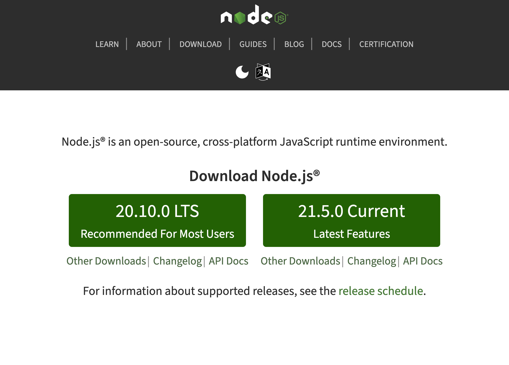
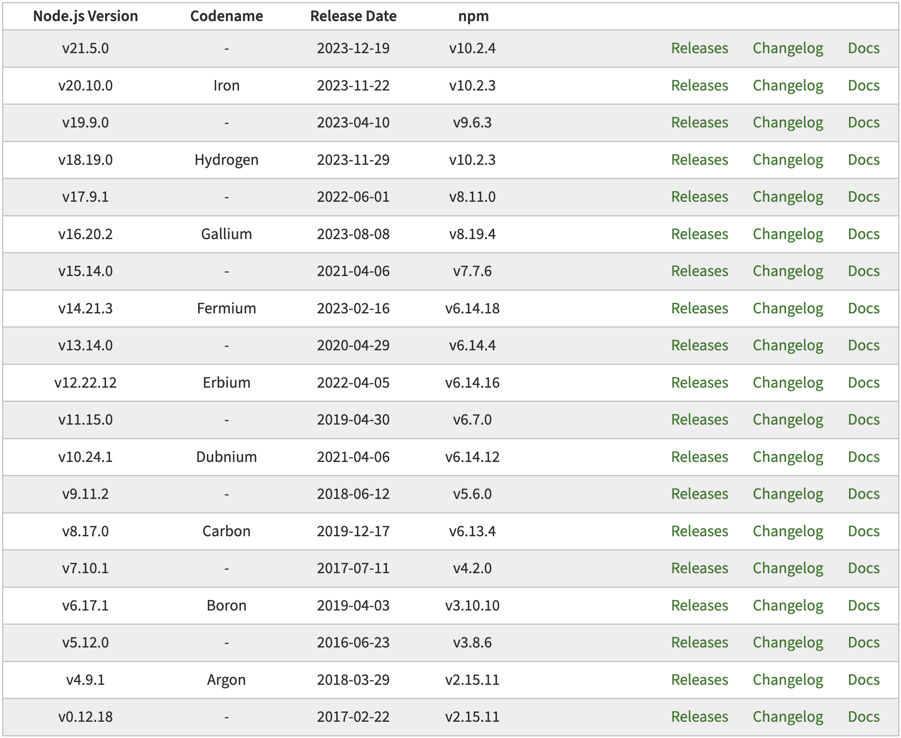

Node.js-버전-정책-이해하기-2.png

[Node.js 홈페이지](https://nodejs.org)를 들어가면, 다운로드 버튼이 나오는데, 하나는 LTS 버전, 다른 하나는 Current 버전이라는 용어가 사용되는 것을 볼 수 있다.

LTS 버전은 "Recommended For Most Users", Current 버전은 "Latest Features"라 문구로 소개되고 있는데, 이 문서에서는 Node.js의 버전 정책에 대해서 알아본다.

Node.js는 매년 **4월**과 **10월**에 새로운 메이저(Major) 버전이 출시된다. 메이저 버전이란, 예를 들어 `19.0.1` 에서 맨 앞 자리 숫자인 19 버전을 말한다. 매년 **4월에는 짝수 메이저 버전**, **10월에는 홀수 메이저 버전**이 출시된다.

기본적으로 신규 메이저 버전이 출시되면, 라이브러리 작성자에게 해당 버전에 대한 지원을 추가할 수 있도록 **6개월 동안 Current 릴리즈 상태** 가 된다.

짝수 메이저 버전의 경우, Current 릴리즈 상태가 지나면 30개월 동안 **LTS(Long Term Support)** 상태가 된다. LTS는 "Node.js 커뮤니티에 의해 장기간 지원받을 수 있는 버전"이라는 뜻으로, 30개월 동안 해당 버전에서 발견되는 각종 버그에 대한 패치를 지원할 것을 보증한다. LTS 기간 중 1년은 활동적으로 지원되는 **Active LTS**, 18개월간은 유지보수 상태인 **Maintenance LTS** 상태가 된다.

홀수 메이저 버전인 경우, 6개월 간의 Current 릴리즈 상태가 지나면 더 이상 지원되지 않는다. 즉, 홀수 버전은 일반적인 사용 목적의 메이저 버전이 아니다.

> 2024년 1월 기준, 18 버전이 Maintenance LTS 상태, 20 버전이 Active LTS 상태, 21 버전이 Current 상태이다.

따라서, 프로덕션 애플리케이션은 안정성을 위해 **항상 LTS 버전을 사용하는 것이 권장**된다. Current 버전은 새롭게 추가된 기능을 사용해볼 수 있는 버전이다.

홀수 버전은 프로덕션 목적의 버전이 아니며, 짝수 버전은 6개월의 Current 릴리즈 상태를 거쳐 30개월 동안 LTS 버전이 된다. LTS 기간이 지난 버전은 Node.js 커뮤니티에 의한 지원을 받을 수 없다.

> 현재까지 출시된 메이저 버전 도표이다. 짝수 버전에는 별도의 코드 네임이 있는 것을 볼 수 있다.

## 참고자료

- https://nodejs.org/en/about/previous-releases
- https://nodejs.org/en/blog/release
- https://www.codeit.kr/tutorials/15/LTS의-의미
