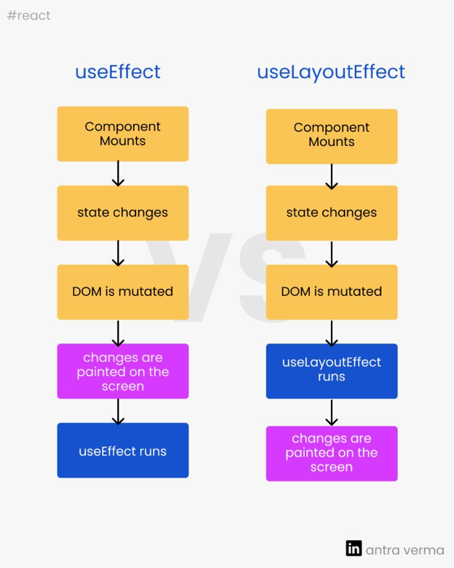

# {{ $frontmatter.title }}

- 타이머 설정, 옵저버 설정 등 [[부수-효과(Side-Effect)|부수 효과(Side Effect)]]이 필요한 경우에 사용한다.
- 컴포넌트의 화면에 렌더링이 완료된 이후에 비동기적으로 실행된다.
- [[의존성-배열(dependency-list)|의존성 배열(dependency list)]]로 어떤 값이 변경되었을 때만 실행되게 할 수 있다.
- 정리(clean-up) 함수를 반환하여 이펙트의 부수 효과를 정리할 수 있다.

## useEffect vs useLayoutEffect

- useEffect : 브라우저의 [[브라우저-렌더링---3.-레이아웃(Layout)-단계|브라우저 렌더링 - 3. 레이아웃(Layout) 단계]]와 [[브라우저-렌더링---4.-페인트(Paint)-단계|브라우저 렌더링 - 4. 페인트(Paint) 단계]]을 완료한 이후에 발생한다.
- useLayoutEffect : 모든 [[브라우저-렌더링---1.-파싱(Parsing)-단계|브라우저 렌더링 - 1. 파싱(Parsing) 단계]]에 동기적으로 발생한다.
- 이펙트 콜백이 **DOM을 변형**시킨다면, useLayoutEffect를 사용해야 한다.

  - DOM이 렌더링 된 이후, 이펙트가 실행되기 전에 DOM에 변형을 해야되는 경우
  - 사용자에게 노출되는 DOM 변경은 노출된 내용의 불일치를 경험하지 않도록 화면을 다 그리기 전에 동기화 되어야 한다.

- [Hooks API Reference – React (reactjs.org)](https://ko.reactjs.org/docs/hooks-reference.html#timing-of-effects)

## Related

## References
