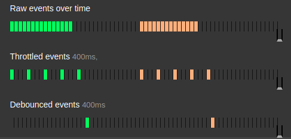

---
tags:
  - tag
aliases:
  - 디바운싱과 쓰로틀링
  - 디바운싱 vs 쓰로틀링
  - debouncing vs throttling
publish: true
created: 2022-01-01 18:17
updated: 2022-01-01 18:17
---

# 디바운싱(debouncing) vs 쓰로틀링(throttling)

- 쓰로틀링 : 이벤트 처리기가 일정 시간 동안 한 번 이상 실행되는 것을 막는 것.
- 디바운싱 : 여러 번의 이벤트를 모아서, 일정 시간이 지난 후 한 번의 이벤트만 처리하도록 하는 것.

## Related

## References

- [Debouncing and Throttling Explained Through Examples | CSS-Tricks - CSS-Tricks](https://css-tricks.com/debouncing-throttling-explained-examples/)
