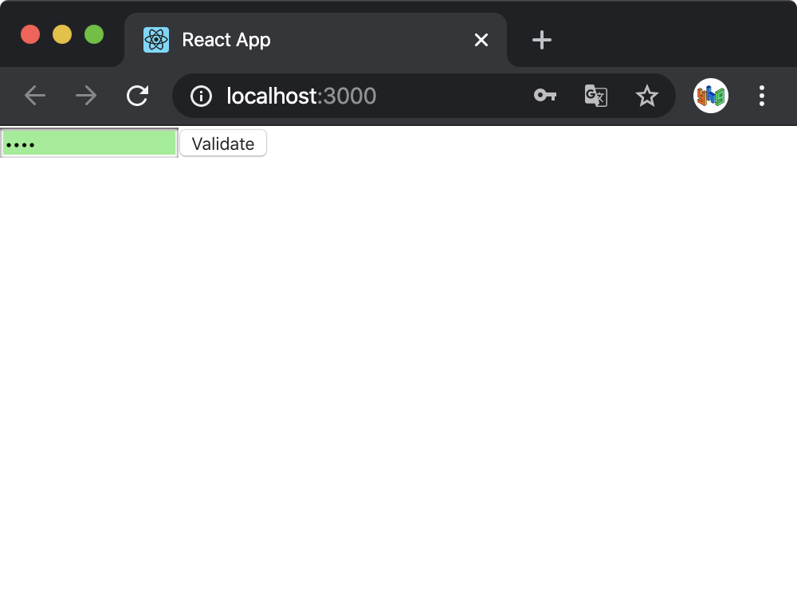
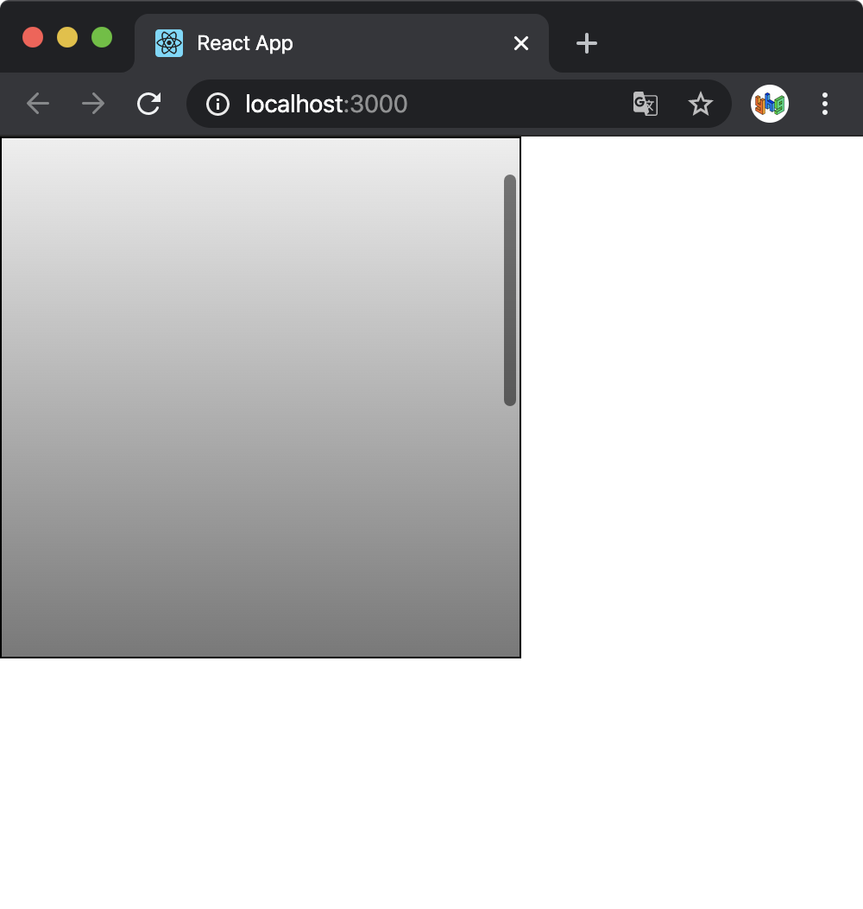
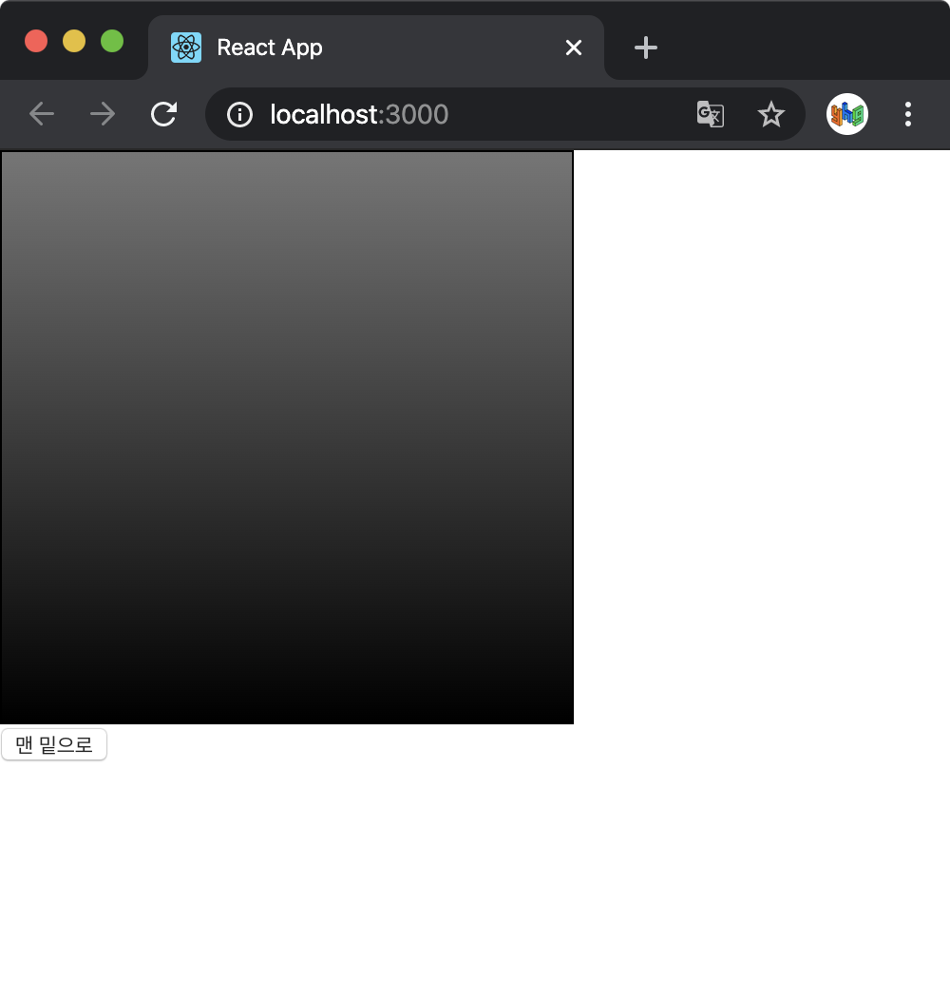

# {{ $frontmatter.title }}


> 이 글은 김민준(velopert)님의 [리액트를 다루는 기술](http://www.yes24.com/Product/Goods/78233628?Acode=101)을참조하여 작성한 글입니다.

일반 HTML에서 DOM 요소에 이름을 달 때 id를 사용한다.

```html
<div id="my-element"></div>
```

이렇게 요소에 id를 달면 CSS에서 특정 id에 특정 스타일을 적용하거나 자바스크립트에서 해당 id를 가진 요소를 찾아 작업할 수 있다.

HTML에서 id를 사용하는 것처럼, 리액트 내부에서 DOM에 이름을 다는 방법이 있는데그것이 ref(reference)의 개념이다.

> 리액트 컴포넌트 안에서도 id를 사용할 수 있지만, HTML에서 DOM의 id는 유일해야하는데, 컴포넌트가 여러 번 사용되면 중복 id가 생기니 잘못된 사용이다. ref는 전역적으로 작동하지 않고, 컴포넌트 내부에서만 작동하기 때문에 문제가 발생하지 않는다.

## ref는 어떤 상황에서 사용해야 할까?

ref는 **"특정 DOM을 꼭 직접적으로 건드려야 할 때"** 사용한다. 순수 자바스크립트혹은 jQuery로 만든 웹사이트에서 input 을 검증할 때는 다음과 같이 작성한다.

```html
<!DOCTYPE html>
<html>
<head>
  <meta charset="utf-8">
  <meta name="viewport" content="width=device-width">
  <title>Example</title>
  <style>
    .success {
      background-color: lightgreen;
    }
    .failure {
      background-color: lightcoral;
    }
  </style>
  <script>
    function validate() {
      var input = document.getElementById('password');
      input.className='';
      if(input.value==='0000') {
        input.className='success';
      } else {
        input.className='failure';
      }
    }
  </script>
</head>
<body>
  <input type="password" id="password"></input>
  <button onclick="validate()">Validate</button>
</body>
</html>
```


리액트에서는 이런 작업이 굳이 DOM에 접근하지 않아도 `state` 로 구현할 수 있다. src 디렉토리에 `ValidationSample.css` 와 `ValidationSample.js` 를 만들어보자.

`ValidationSample.css`

```css
.success {
	background-color: lightgreen;
}

.failure {
	background-color: lightcoral;
}
```

`ValidationSample.js`

```javascript
import React, {Component} from 'react';
import './ValidationSample.css';

class ValidationSample extends Component {
	state = {
		password: '',
		clicked: false,
		validated: false,
	};

	handleChange = (e) => {
		this.setState({
			password: e.target.value,
		});
	};

	handleButtonClick = () => {
		this.setState({
			clicked: true,
			validated: this.state.password === '0000',
		});
	};

	render() {
		return (
			<div>
				<input
					type="password"
					value={this.state.password}
					onChange={this.handleChange}
					className={
						this.state.clicked
							? this.state.validated
								? 'success'
								: 'failure'
							: ''
					}
				/>
				<button onClick={this.handleButtonClick}>Validate</button>
			</div>
		);
	}
}

export default ValidationSample;
```

`ValidationSampe.js` 를 보면, input의 `onChange` 이벤트가 발생했을 때, `handleChange` 를 호출하여 password 값을 업데이트하고, button 에서 `onClick` 이벤트가 발생했을 때 `handleButtonClick` 을 호출하여 `clicked` 값을 참으로 설정하고, `validated` 값을 검증 결과로 설정했다.

input 의 `className` 은 버튼을 누르기 전에는 빈 문자열, 버튼을 누른 후에 검증이성공하면 `success` , 실패하면 `failure` 로 설정했다. 이에 따라 input 의 색상이초록색 또는 빨간색으로 나타난다.

App 컴포넌트에서 `ValidationSample` 컴포넌트를 불러와 렌더링해본다.

`App.js`

```javascript
import React, {Component} from 'react';
import ValidationSample from './ValidationSample';

class App extends Component {
	render() {
		return <ValidationSample />;
	}
}

export default App;
```



원하는 결과가 잘 나타나는 것을 확인할 수 있다. 이렇게 자바스크립트에서는 DOM에접근해야 했던 기능을 리액트에서는 state를 사용하여 구현할 수 있다. 하지만 state 만으로 해결할 수 없는 기능들이 있다.

(예시)

- 특정 input에 포커스 주기

- 스크롤 박스 조작하기

- Canvas 요소에 그림 그리기

이렇게 DOM에 직접 접근해야 하는 상황을 위해 ref를 사용한다.

## ref 사용

ref를 사용하는 방법은 두 가지이다.

### 콜백 함수를 통한 ref 설정

ref를 만드는 가장 기본적인 방법은 콜백 함수를 사용하는 것이다. ref를 달고자 하는요소에 콜백 함수 ref를 props로 전달해주면 된다. 이 콜백 함수는 ref 값을 파라미터로 받고, ref를 컴포넌트의 멤버 변수로 설정해준다.

```javascript
<input
	ref={(ref) => {
		this.input = ref;
	}}
/>
```

이렇게 하면 `this.input` 이 input 요소의 DOM을 가리키게 된다. 이 때, 이름은 `this.input` 뿐만 아니라 원하는 것으로 자유롭게 설정할 수 있다.

### createRef를 통한 ref 설정

리액트에 내장되어 있는 createRef 라는 함수를 사용해 ref를 만들 수도 있다. 이 기능은 리액트 v16.3부터 도입되었다.

```javascript
import React, {Component} from 'react';

class RefSample extends Component {
	input = React.createRef();

	handleFocus = () => {
		this.input.current.focus();
	};

	render() {
		return (
			<div>
				<input ref={this.input} />
			</div>
		);
	}
}

export default RefSample;
```

createRef를 사용하여 ref를 만들려면 먼저 컴포넌트 내부에서 멤버 변수로 `React.createRef()` 를 담아준다. 그리고 해당 멤버 변수를 ref를 달고자 하는 요소에 ref props로 넣어주면 된다.

이렇게 설정하고 나중에 DOM에 접근하려면 `this.input.current` 처럼 뒤에 `.current` 를 넣어주어야 한다.

### ref로 버튼 클릭 시 input으로 포커스 이동 구현

위에서 만들었던 `ValidationSample` 에서 Validate 버튼 클릭 시 input으로 포커스가넘어가도록 코드를 수정해본다.

#### input에 ref 달기

배운 대로 input 요소에 ref를 적용한다.

`ValidationSample.js`

```javascript
(...)
    <input>
      ref={(ref) => this.input=ref}
      (...)
    />
```

#### 버튼 `onClick` 이벤트 수정

버튼에서 `onClick` 이벤트가 발생할 때 input에 포커스를 주도록 코드를 수정한다. ref 를 적용했기 때문에 이제 `this.input` 으로 DOM을 접근할 수 있으므로, 일반 DOM 의 함수를 사용할 수 있다.

`ValidationSample.js`

```javascript
handleButtonClick = () => {
	this.setState({
		clicked: true,
		validated: this.state.password === '0000',
	});
	this.input.focus();
};
```

이제 코드를 실행해보면 버튼 클릭시 포커스가 input 요소로 넘어가는 것을 볼 수 있다.

## 컴포넌트에 ref 달기

리액트에서는 컴포넌트에도 ref를 달 수 있다. 이렇게 하면 컴포넌트 내부에 있는 DOM 을 컴포넌트 외부에서 사용할 수 있다.

### 사용법

```javascript
<MyComponent
	ref={(ref) => {
		this.myComponent = ref;
	}}
/>
```

이렇게 한 이후에, `myComponent.handleClick` , `myComponent.input` 등으로 컴포넌트 내부 ref(DOM 요소)에 접근할 수 있게 된다.

### 스크롤 박스 예제

이제 스크롤 박스 예제를 만들어 본다.

`ScrollBox.js`

```javascript
import React, {Component} from 'react';

class ScrollBox extends Component {
	render() {
		const style = {
			border: '1px solid black',
			height: '300px',
			width: '300px',
			overflow: 'auto',
			position: 'relative',
		};

		const innerStyle = {
			width: '100%',
			height: '650px',
			background: 'linear-gradient(white, black)',
		};

		return (
			<div
				style={style}
				ref={(ref) => {
					this.box = ref;
				}}
			>
				<div style={innerStyle} />
			</div>
		);
	}
}

export default ScrollBox;
```

App 컴포넌트에서는 기존 `ValidationSample` 을 지우고 `ScrollBox` 컴포넌트를 렌더링한다.

`App.js`

```javascript
import React, {Component} from 'react';
import ScrollBox from './ScrollBox';

class App extends Component {
	render() {
		return (
			<div>
				<ScrollBox />
			</div>
		);
	}
}

export default App;
```



코드를 저장하면, 웹 브라우저에 스크롤 박스가 잘 렌더링된다.

이제 버튼을 추가하고 버튼을 클릭했을 때, 스크롤 박스의 스크롤바를 맨 아래쪽으로내리는 메소드를 만들어본다. 이 기능을 구현하기 위해 DOM 노드가 가진 값을 사용한다.

- `scrollTop` : 세로 스크롤바 위치

- `scrollHeight` : 스크롤이 있는 박스 안의 `div` 높이

- `clientHeight` : 스크롤이 있는 박스의 높이

> 스크롤을 내려야 볼 수 있는 박스 내부의 긴 콘텐츠 → `scrollHeight` 긴 콘텐츠를스크롤바로 감싸는 박스 → `clientHeight`

스크롤바의 위치 `scrollTop` 은 0부터 (박스 내부의 긴 콘텐츠 - 스크롤바로 감싸고있는 바깥의 박스)의 크기 값을 가진다. (바깥의 박스가 300이고 내부의 콘텐츠가 650 이라면 스크롤바의 위치가 0~350)

따라서 스크롤바를 맨 아래쪽으로 내리려면 `scrollHeight` 에서 `clientHeight` 를빼면 된다.

`ScrollBox.js`

```javascript
import React, {Component} from 'react';

class ScrollBox extends Component {
	scrollToBottom = () => {
		const {scrollHeight, clientHeight} = this.box;
		this.box.scrollTop = scrollHeight - clientHeight;
	};
	render() {
		const style = {
			border: '1px solid black',
			height: '300px',
			width: '300px',
			overflow: 'auto',
			position: 'relative',
		};

		const innerStyle = {
			width: '100%',
			height: '650px',
			background: 'linear-gradient(white, black)',
		};

		return (
			<div
				style={style}
				ref={(ref) => {
					this.box = ref;
				}}
			>
				<div style={innerStyle} />
			</div>
		);
	}
}

export default ScrollBox;
```

`ScrollBox` 컴포넌트에서, `this.box` 로 스크롤바가 있는 박스 DOM에 접근할 수 있고, `scrollToBottom` 이라는 메소드가 이 DOM에 접근하여 스크롤바의 위치 `scrollTop` 를 맨 아래로 변경한다.

이렇게 만들고 나서 부모 컴포넌트인 App 컴포넌트에서 `ScrollBox` 컴포넌트에 ref를달고, 버튼을 만든 다음, `onClick` 이벤트에 `ScrollBox` 컴포넌트의 메소드인 `scrollToBottom` 를 실행하도록 한다.

`App.js`

```javascript
import React, {Component} from 'react';
import ScrollBox from './ScrollBox';

class App extends Component {
	render() {
		return (
			<div>
				<ScrollBox ref={(ref) => (this.ScrollBox = ref)} />
				<button onClick={() => this.ScrollBox.scrollToBottom()}>
					맨 밑으로
				</button>
			</div>
		);
	}
}

export default App;
```



맨 밑으로 버튼을 눌렀을 때 스크롤바가 맨 밑으로 이동하는 것을 확인할 수 있다.

그런데 주의할 점이 있는데, button 요소에 `onClick` 이벤트를 등록할 때, `onClick = {this.scrollBox.scrollToBottom}` 으로 작성하는 것이 문법상으로 틀린것은 아니다. 하지만 컴포넌트가 처음 렌더링 될 때는 `this.scrollBox` 값이 undefined 이다. (ref 등록이 콜백함수 이므로)

따라서 화살표 함수 문법으로 새로운 함수를 만들고, 그 내부에서 `this.scrollBox.scrollToBottom` 메소드를 실행하면 버튼을 누를 때, (이미 한번 렌더링을 거쳐 `this.scrollBox` 를 설정한 시점) `this.scrollBox.scrollTobottom` 값을 읽어 와서 실행하므로 오류가 발생하지 않는다.

## 정리

컴포넌트 내부에서 DOM에 직접 접근해야 할 때는 ref를 사용한다. 하지만 ref를 사용하지 않고 원하는 기능을 구현할 수 있는지를 반드시 고려해야 한다.

서로 다른 컴포넌트끼리 데이터를 교류할 때 ref를 사용하는 것이라고 오해할 수 있는데, 그렇게 하는 것은 애플리케이션의 구조를 꼬이게 만들 수 있는 위험한 방법이다. 따라서 데이터를 교류할 때는 언제나 부모 - 자식 흐름으로 교류하는 것이 좋다.

## 같이 읽기

[Ref와 DOM - React](https://ko.reactjs.org/docs/refs-and-the-dom.html#gatsby-focus-wrapper)
