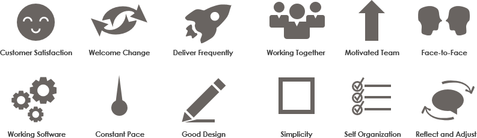

일을 빠르게 하기 위해서가 아니라, **고객과 시장의 변화에 빠르게 대처하기 위한 방법**이다.

## 에자일 소프트웨어 개발 선언

- 공정과 도구보다 **개인과 상호작용**을
- 포괄적인 문서보다 **작동하는 소프트웨어**를
- 계약 협상보다 **고객과의 협력**을
- 계획을 따르기보다 **변화에 대응하기**를

## 에자일 소프트웨어의 12가지 원칙

1. 초기부터 지속적으로 고객 만족
2. 요구사항 변경 수용
3. 짧은 배포 간격
4. 기획자/현업과 개발자는 함께 일하기
5. 동기부여된 팀원들로 프로젝트팀 만들기
6. 얼굴보고 대화하기
7. 동작되는 소프트웨어로 진도 측정
8. 지속 가능한 개발 속도 유지
9. 좋은 기술, 설계에 관심
10. 단순성
11. 자기 조직화 팀
12. 정기적으로 효율성 제고

## References

- [애자일 소프트웨어 개발 선언 (agilemanifesto.org)](https://agilemanifesto.org/iso/ko/manifesto.html)
- [Agile Principles(애자일 12가지 원칙). 고객과 시장의 변화에 빠르게 대처하며 Agile하게 일하기 위한… | by 민현기(Min, Hyun Gi) | 민현기(Min, Hyun Gi)’s Blog | Medium](https://medium.com/hgmin/agile-principles-%EC%95%A0%EC%9E%90%EC%9D%BC-12%EA%B0%80%EC%A7%80-%EC%9B%90%EC%B9%99-d3f386bd9839)
