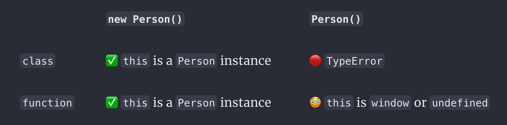

# {{ $frontmatter.title }}

## Class를 사용한 상속 방법

```js
// Shape - 상위클래스
class Shape {
	constructor() {
		this.x = 0;
		this.y = 0;
	}

	// 상위클래스 메서드
	move(x, y) {
		this.x += x;
		this.y += y;
		console.info('Shape moved.');
	}
}

// Rectangle - 하위클래스
// 하위클래스는 상위클래스를 확장
class Rectangle extends Shape {
	constructor() {
		// super 생성자 호출.
		super();
	}
}

var rect = new Rectangle();

console.log('Is rect an instance of Rectangle?', rect instanceof Rectangle); // true
console.log('Is rect an instance of Shape?', rect instanceof Shape); // true
rect.move(1, 1); // Shape moved.
```

```js
class Animal {
	constructor(name) {
		this.speed = 0;
		this.name = name;
	}

	run(speed) {
		this.speed = speed;
		alert(`${this.name} 은/는 속도 ${this.speed}로 달립니다.`);
	}

	stop() {
		this.speed = 0;
		alert(`${this.name} 이/가 멈췄습니다.`);
	}
}

let animal = new Animal('동물');

class Rabbit extends Animal {
	hide() {
		alert(`${this.name} 이/가 숨었습니다!`);
	}
}

let rabbit = new Rabbit('흰 토끼');

rabbit.run(5); // 흰 토끼 은/는 속도 5로 달립니다.
rabbit.hide(); // 흰 토끼 이/가 숨었습니다!
```


## [[클래스(Class)|클래스 문법]]은 단지 "[[구문적-설탕(Syntatic-sugar)|구문적 설탕(Syntatic sugar)]]" 인가?

- 클래스 문법을 사용하는 것과 비슷한 결과를 기존 function + prototype 문법의 조합으로 만들 수 있기 때문에 일부 사람들은 단지 클래스 문법을 "[[구문적-설탕(Syntatic-sugar)|구문적 설탕(Syntatic sugar)]]"이라고 말한다.
- 하지만 몇 가지 중요한 차이가 있다.
  - 클래스 함수엔 [특수 내부 속성인 `[[FunctionKind]]: "classConstructor"` 가 이름표처럼 붙어서](https://262.ecma-international.org/6.0/#sec-ecmascript-function-objects), 이 클래스 생성자를 new 와 함께 호출하지 않으면 에러가 발생한다.
  - 클래스의 메소드는 [[enumerable(열거-가능)|enumerable(열거 가능)]] 로, [[for-of-vs-for-in]] 구문 등의 객체 열거에서 메서드는 열거하지 않는다. ([[JavaScript-객체(Object)|JavaScript 객체(Object)]]가 false 이다.)
  - 클래스는 항상 [[엄격-모드(strict-mode)|엄격 모드(strict mode)]]이다.
  - 이외에도 getter, setter, 믹스인 등의 기능이 있다.



## Related

- [[프로토타입(prototype)]]
- [[Object.create()]]

## References

- [Classes - JavaScript | MDN (mozilla.org)](https://developer.mozilla.org/ko/docs/Web/JavaScript/Reference/Classes)
- [클래스 상속 (javascript.info)](https://ko.javascript.info/class-inheritance)
